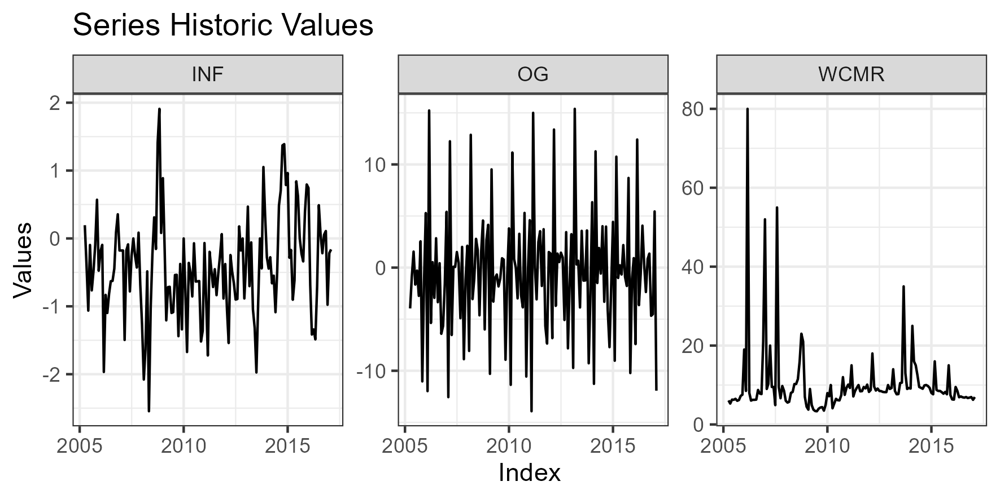
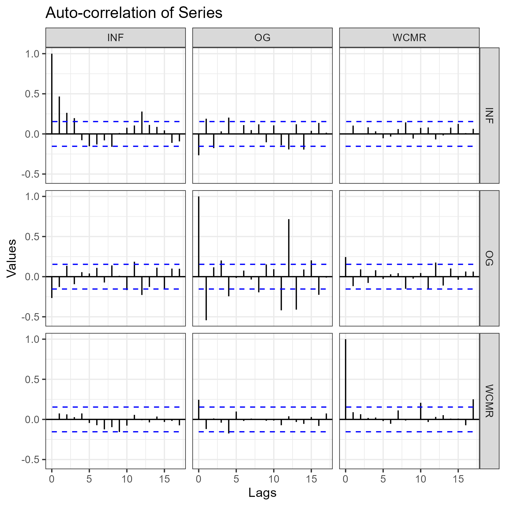
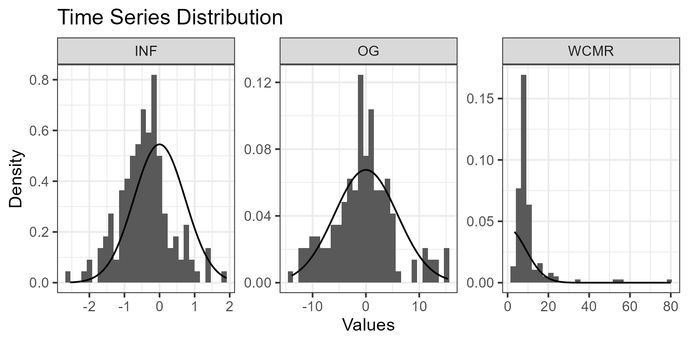
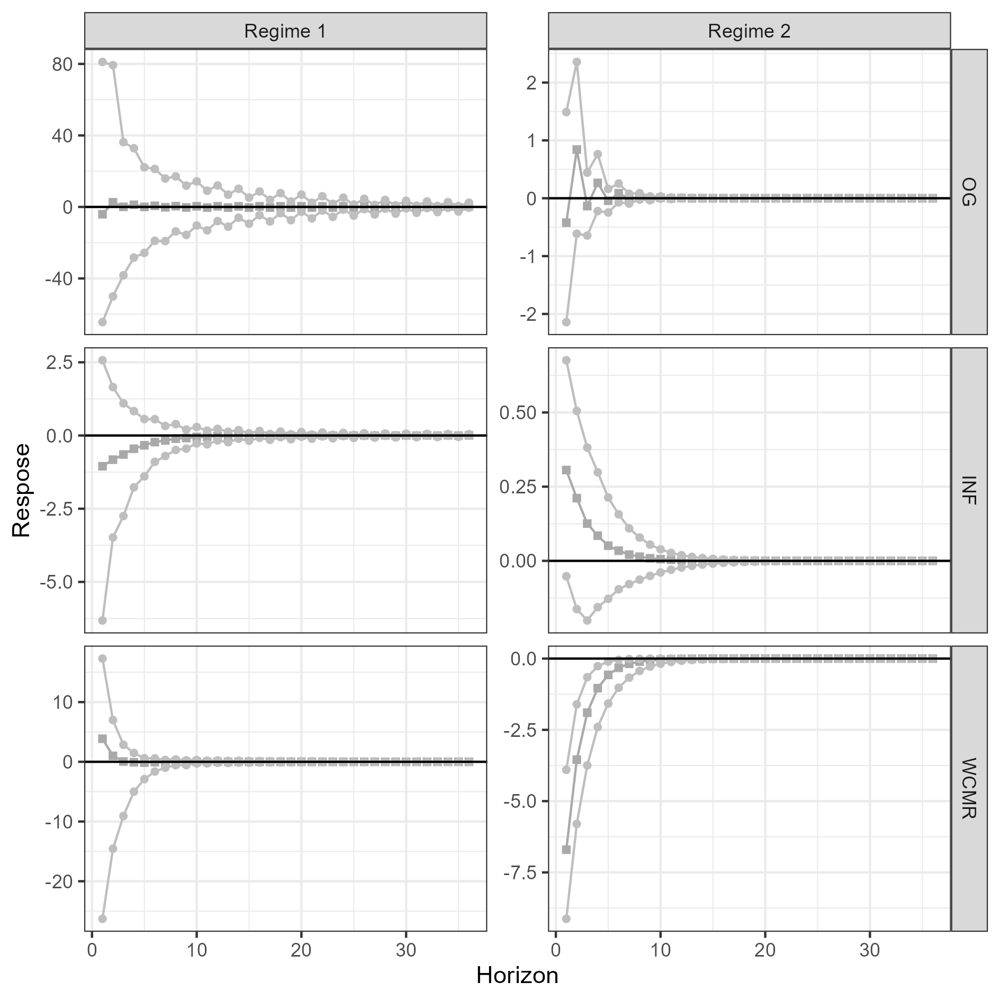

# Introduction

Understanding how uncertainty affects monetary policy effectiveness is crucial as it directly impacts economic stability. The literature recognizes that monetary policy operates through various channels whose effectiveness varies with economic structure, meaning developed and developing countries experience different outcomes. Additionally, effectiveness changes over time, potentially due to varying uncertainty levels. Evidence largely suggests that increased uncertainty diminishes monetary policy effectiveness, though most research focuses on developed economies rather than developing ones.

The paper [@nain2020] makes an important contribution by employing a Markov Switching VAR model to endogenously identify regimes of high and low uncertainty in India's economy, filling a gap in literature that has predominantly focused on developed countries. While their methodology, which includes the use of regime-dependent impulse response functions, is sound, some aspects could be improved. These include insufficient detail on the Gibbs sampling procedure (particularly regarding priors and conditional distributions), lack of posterior distribution diagnostics, limited sensitivity analysis for variable proxies, and minimal visual representation of data properties. In my replication, I will maintain fidelity to their approach while addressing these gaps, with particular focus on elaborating the Bayesian methodology and diagnostic procedures.

The code, data, and typesetting scripts can be found [in my GitHub](https://github.com/ricardo-semiao/task-masters/tree/main/bayesian-econometrics).

This section is about interpreting and commenting the work, which can be less relevant, although it motivates my changes to the original paper. Section 2 is about the methodology, where lies my main contribution of a more described sampler. Section 3 replicates the data analysis, which I value, but is less relevant in the econometric viewpoint. Section 4 shows the sampler results. Lastly, I conclude in section 5.

## Overview of the Paper

### Motivation and Literature Review

The authors start by describing the several channels through which monetary policy affects the economy, noting how the differences in their effectiveness are not yet fully understood, but how it is affected by the economic structure. This implies that developed countries will have different realities than developing ones. Furthermore, they cite [@sengupta2014], who argues that the effectiveness of monetary policy also changes with time, which could be associated with changes in different uncertainties.

Additionally, the concept of uncertainty is discussed, being associated with forecast inability and risk, two hard-to-differentiate components. This is important to choose what uncertainty measure to use, with volatility being the preferred one.

The authors cite other papers, citations from monetary authorities, and stylized facts, to establish a consensus that more uncertainty diminishes the effectiveness of monetary policy, and hypotheses of the how.

Finally, they motivate their work by citing that much of this evidence is focused on developed countries, and that they will fill the hole by studying India. Additionally, the empirical literature uses VAR models with different measures of uncertainty, but few define endogenous regimes of high and low uncertainty, which the authors will do via the Markov Switching model.

### Methodology

The authors defend the use of a Markov Switching VAR model, as its non-linear nature allows for capturing dynamic properties (time-varying cycles, breaks/jumps, etc.). The description of the model is in section @sec-msvar.

For its estimation, the authors defend the use of Bayesian MCMC, as it is more flexible and provides full posterior distributions of all parameters, which is important to build the impulse response functions (IRFs). The authors follow the Gibbs sampling procedure outlined in [@balcilar2017], described in section @sec-estimation.

Regime-dependent IRFs are calculated following [@ehrmann2003], which assume regime switching does not occur beyond the shock horizon. Identification needs further assumptions, and the authors use the Cholesky decomposition in the order of OG, INF, and IR (see data section), with the justification that real variables respond with a time lag to the monetary policy shocks which in turn respond contemporaneously to the real sector shocks.

### Data and Data Analysis

The dataset used includes three variables from the EPW time-series database: Index of Industrial Production (IIP), Wholesale Price Index (WPI), and Weighted Call Money Rate (WCMR)[^codenames]. All are with monthly frequency for the period of April 1991 to December 2016, including only the period after a structural reform and financial liberalization of the 90s.

[^codenames]: The authors use several names for the variables, which was confusing. IIP is transformed into GIIP and OG (output growth), WPI is transformed into INF (inflation), and WCMR is also called IR (interest rate). 

IIP and WPI were seasonally adjusted via X-13 ARIMA-SEATS of U.S. Census Bureau. Additionally, they were transformed into growth rates (in percentage terms) to be used as the proxies for output growth (OG) and inflation (INF), respectively.

The authors discuss the changes in monetary policy in India, which ultimately led to the choice of Weighted Call Money Rate (WCMR) as the indicator of the policy variable.

The authors present summary statistics and tests in table 1. Specifically, they show evidence for: auto-correlation via Ljung-Box tests (for all variables, lags 1 and 4); non-normality via Jarque-Bera tests (for INF and OG); ARCH structure via LM statistics (for all the variables); and the coefficient of variation. Additionally, they plot the series and match their shifts to real-world macroeconomic events.

The authors run unit root tests, but run too many. Zivot-Andrews and Lee-Strazicich unit root tests were done, as they better account for structural breaks, something important in a regime switching context. They consider drift and drift + trend specifications, with lags chosen by BIC. In general, they find evidence that OG is stationary and WPI and WCMR aren't.

### Findings and Conclusions

The authors successfully identify a high and low uncertainty differentiation of the regimes, as regime 2 coincides with several known crises and shocks. The plotted series against the regimes show signs of increased volatility and/or negative trends during the high uncertainty regime.

Both regimes are highly persistent, with $p_{11} = 0.922$ and $p_{22} = 0.914$. The long-run average probability of regime 1 is greater than 2's, which aligns with the probability for recessionary periods being lesser than expansionary periods.

The regime-dependent impulse response functions (RDIRFs) reveal different responses of the variables to a monetary policy shock, depending on the regime:

> We see that the responses of output growth and inflation facing a positive shock in monetary policy (tight monetary policy) are significant and in line with the conventional economic theory in both regimes. However, in the high uncertainty regime, responses are less compared to the responses in the low uncertainty regime. Output growth falls by at most approximately 0.61% in the low uncertainty regime, while in the high uncertainty regime it falls by at most approximately 0.30%. _[...]_ A similar pattern is observed for the response of inflation following the shock in monetary policy. However, the difference between the peak response of inflation in low and high uncertainty regimes is less than output growth.

As a sensitivity analysis, the authors change the ordering to OG, IR, and INF. The general findings stay the same, with only intensities changing.

The authors show that these findings are in line with existing theoretical justifications for dampened effects of monetary policy during periods of high uncertainty. They prescribe avoiding "wait and see" policy framing to avoid uncertainty in agents and more aggressive policy measures during high uncertainty periods (state-dependent policy). Additionally, more communication from the monetary authority is recommended to reduce uncertainty.

## General Comments

In general, the paper is well-written and the methodology is sound. Specifically, they motivate their work and explain the results with very thorough references to the literature. The usage of RDIRFs is a good novelty, and the Bayesian approach helps this implementation.

Some points could be improved, in order of importance:

1. A better description of the Gibbs sampling procedure: the priors for each parameter, the conditional distributions used in each sampling step, and initial values, all should've been better described, specifically in mathematical terms. More details on the prior justifications should've been included, explaining their level of informativeness. This would help to show how robust the results are (or aren't) to the priors.
2. Diagnostics on the posterior distributions of the parameters: information on the effective sample size of the chains, convergence and dependence plots and diagnostics, etc. would help to show the quality of the Bayesian procedure.
3. Sensibility analysis in the chosen proxies for variables: there are other price and production indexes that could've been used to see if the results hold. The authors discuss the difficulty of monetary policy proxy selection, but could've considered other options too.
4. A more visual approach to the data analysis: histograms and ACF plots would've accompanied the Jarque-Bera and Ljung-Box tests well, showing more information about the data.
5. More detail on the minor modeling procedures: the parameters of the X13-ARIMA-SEATS de-seasonalization; results of the selection of $p$ and $m$ (the information criteria values associated with all the values considered); BIC criteria instead of AIC, given the small sample size.

In this replication, I intend to follow the paper as closely as possible, while also addressing some of the points above. My main focus will be on the methodology points 1 and 2.

# Methodology

## The MS-VAR Model {#sec-msvar}

The authors defend the use of a Markov Switching VAR model, as its non-linear nature allows for capturing dynamic properties (time-varying cycles, breaks/jumps, etc.). I'll briefly describe it below.

$$
\begin{array}{l}
    X_t = \begin{cases}
        \alpha_1 + \beta_{11}X_{t-1} + \dots + \beta_{p1}X_{t-p} + A_1v_t & \text{if} ~~ S_t = 1\\
        ~~~~~~~~~~~~~~~~~~~~~\vdots &\\
        \alpha_m + \beta_{1m}X_{t-1} + \dots + \beta_{pm}X_{t-p} + A_mv_t & \text{if} ~~ S_t = m\\
    \end{cases}\\
    V_t \sim N(0, I_k)
\end{array}
$${#eq-msvar}

Where:

- $X_t$ are the $K$ endogenous variables. Let $X \coloneqq (X_t)_{t = 1}^T$.
- $\Phi_i \coloneqq [\alpha_i, \beta_{1i}, \dots, \beta_{pi}]$ (each element a row), for all the $m$ regimes $i$, are the $K \times (p+1)$ VAR($p$) coefficients. <!-- , and $X^i \coloneqq [X_{t-1} | \dots | X_{t-p}]$ -->
- $A_iv_t$ are the residuals, with $A_i$ being a $K \times K$ matrix.
- $S_t$ is an unobserved regime variable.

Consider the alternate formulation, that will be useful for prior formulation:

$$
\begin{array}{l}
    X_t = \begin{bmatrix}\pmb{1}_k & X_{t-1} & \dots & X_{t-p}\end{bmatrix} \cdot \Phi_i + A_iv_t,~~ \forall_{i \in \{1, \dots, m\}}
\end{array}
$${#eq-msvar-mat}

Note that the variance-covariance matrix of the residuals is regime dependent:

$$
\Sigma_{i} = E\Big(A_{i}V_{\nu}V_{\nu}^{'}A_{i}^{'}\Big)=A_{i}E\left(V_{\nu}V_{\nu}^{'}\right)A_{i}^{'}=A_{i}I_{K}\,A_{i}^{'}=A_{i}A_{i}^{'}
$${#eq-cov-matrix}

$S_t$ is assumed to be independent of past $X$'s, and, conditional on $S_{t-1}$, follows a hidden Markov process:

$$
Pr(S_t = j | S_{t-1} = i) = p_{ij},~~ \forall_t,~ \forall_{i,j \in \{1, \dots, m\}}
$$

The transition probabilities are grouped in the transition probability matrix $P$:

$$
P = \begin{bmatrix}
    {{P_{11}}}&{{P_{12}}}&{{\cdot\cdot\cdot}}&{{P_{1m}}}\\
    {{p_{21}}}&{{p_{22}}}&{{\cdot\cdot}}&{{P_{2m}}}\\
    {{\vdots}}&{{\vdots}}&{{\ddots}}&{{\vdots}}\\
    {{P_{m1}}}&{{P_{m2}}}&{{\cdot\cdot}}&{{P_{m m}}}
\end{bmatrix}
$${#eq-transition-matrix}

Equations -@eq-msvar, -@eq-cov-matrix, and -@eq-transition-matrix are the core model. All parameters are allowed to switch with the regime. Regime changes are treated as random events modelled by the Markov process.

In the paper, $K = 3$ (see data section), $p = 2$ (see model selection section), $m = 2$ (high and low uncertainty), and $T = 312$ time periods. Then, we have the following parameters:

- $(\Phi, \Sigma, P)$ is comprised of $m \cdot (k*(p+1) + K^2 + m) = 40$ parameters.
    - All the $m$ $\Phi_i$'s, the $K \times (p+1)$ matrix of coefficients.
    - All the $m$ $K \times K$ variance-covariance matrices $\Sigma = \{\Sigma_i: i = 1, \dots, m\}$.
    - The $m \times m$ transition probability matrix $P$.
- We are also going the estimate the standard error matrix of $\Phi$ and the variable $S$ ($T$ entries).
    - If coefficients are taken as independent, $\Phi$ has $(1 + 2K) \cdot K = 21$ free entries. If they are taken to be independent across equations, it has $(1 + 2K)^2 \cdot K = 147$ free entries.

## Estimation {#sec-estimation}

The authors note that estimation of Markov switching models can be performed using Maximum Likelihood (ML) or the Expectation-Maximization (EM) algorithm. However, the ML approach becomes computationally intensive and challenging to implement as the number of parameters increases. The EM algorithm, while more tractable, doesn't provide standard errors directly, requiring additional computations. The authors choose the Bayesian Markov Chain Monte Carlo (MCMC) approach as it is more flexible and provides full posterior distributions of all parameters.

The authors follow the Gibbs sampling procedure outlined in [@balcilar2017]. The procedure was poorly described (in both papers), below I give more details on the steps, priors, and initial values, with some personal choices.

### Priors

First, note that the likelihood for an MS‑VAR with Gaussian errors is the sum over all possible regime sequences $(S_1,\dots,S_T)$, given transitional probabilities:

$$
\ell(\theta) = L(X | \theta) = \sum_{S_1=1}^m \dots \sum_{S_T=1}^m \left[\prod_{t=1}^T f\bigl(X_t \mid X_{t-1},\dots,X_{t-p},S_t,\theta\left)P\bigl(S_t\mid S_{t-1},P\right)\right]
$${#eq-lik}

Where $f$ is the Gaussian density, such that the likelihood has overall Gaussian functional form. Now, we can discuss the parameter's priors.

#### VAR coefficients ($\Phi_i$)

For each regime, normal priors. I consider two sets of parameters, one empirically-driven, and Minnesota-type set, following [@litterman1986].

The Minnesota parameters are as below. Other specifications could've been considered.

- Intercepts have $0$ mean and $\sigma^2_{\alpha_k}$ variance. Let $\sigma^2_\alpha$ denote the aggregating vector.
- AR(1) coefficients have $1$ mean, and $0$ for all the others.
- AR(p) variances are $(\sigma^2_{\beta_{ii}}/p)^2$, and the related to equation $i$/variable $j$ are $(\sigma^2_{\beta_{ii}}\theta\sigma_i/p\sigma_j)^2$. Let $v_{ip}$ denote the row of such variance matrix.
- $0 < \theta < 1$ controls the relative tightness of the prior variance in the other lags, and $\sigma_i$ is the $i^{\text{th}}$ diagonal element of $\Sigma_i$.
- Let V be the vector with all the elements in $\sigma^2_\alpha$, $v_{11}$, $v_{12}$, $v_{13}$, $v_{21}$, $\dots$.
- I use $\theta = 0.1$, as the cross-correlation functions show little correlation between the variables (see data section). The values of $\sigma^2_{\beta_{ii}}$ are taken by the estimated variance of each VAR (OLS).

The emprical-driven one considers intercepts to be the unconditional averages of the series, and smaller AR(1) coefficients following the stationary evidence from the data section. The covariance is taken from the OLS estimates.

Then, $\text{vec}(\Phi_i)$ is distributed as a multivariate normal distribution, with averages (in order):

$$
\begin{array}{ccc}
    \mu_{\Phi_i} = \text{vec}\left(\begin{bmatrix}
        0 & 0 & 0\\
        1 & 0 & 0\\
        0 & 1 & 0\\
        0 & 0 & 1\\
        0 & 0 & 0\\
        0 & 0 & 0\\
        0 & 0 & 0
    \end{bmatrix}\right), & \text{vec}\left(\begin{bmatrix}
        -0.8 & 0 & 7\\
        0.7 & 0 & 0\\
        0 & 0.7 & 0\\
        0 & 0 & 0.7\\
        0 & 0 & 0\\
        0 & 0 & 0\\
        0 & 0 & 0
    \end{bmatrix}\right) & \forall_{i \in \{1, \dots, m\}}
\end{array}
$$

And variances (in order):

$$
\begin{array}{ccc}
    \Sigma^2_{\Phi_i} = \text{diag}(V), & \text{block-diag}(Cov(\Phi^{OLS}, 3)) & \forall_{i \in \{1, \dots, m\}}
\end{array}
$$

There could be added covariance terms to the diagonal structure of the Minnesota set. Also, $\text{block-diag}(., 3)$ creates a block diagonal structure with 3 row/column blocks.

I did not implemented the Minnesota prior as a hierarchical one, by dynamically updating the hyperparameters $\sigma_i$ and $\sigma_j$. Instead, I considered them as fixed, taken from the OLS estimate of $\Sigma$. At the end, the empirical prior yielded better convergence results, so it was the one used.

#### Transition probabilities ($P$)

Dirichlet priors with parameters 0.8 and 0.2 (respectively) following the authors argument on high persistence of regimes.

Let $P_i$ denote $P$'s $i^{\text{th}}$ row, then:

$$
P \sim Dir((0.8, 0.2))
$$

#### Variance-covariance matrices ($\Sigma_i$)

For each regime, inverse-Wishart priors, following [@balcilar2017]. <!-- the authors use hierarchical prior... -->

The scaling matrix is the sample covariance matrix of the data, which is similar to the covariance matrix of the OLS residuals. It was used very low degree of freedom, to be less informative. $K+1$ is the minimum for a proper prior. Larger values than that yielded poor convergence.

$$
\Sigma_i \sim IW(K+1, \widehat{Cov}(X))
$$

### Initial Values

I'll set $P$'s initial value as $P_1 = (0.8, 0.2)$ and $P_2 = (0.2, 0.8)$. For the sampling of $S$, I use a $\pmb{0.5}_{m \times m}$ matrix, to avoid a series dominated by the regime $S_0$, from it, $S$ is sampled following the Markov Process. For $\Sigma_i$, the initial values are taken empirically from the covariance matrix of the OLS residuals. The other parameters do not need initialization.

<!-- **VAR coefficients ($\Phi_i$):** the initial values are the same, equal to the prior's mean. That is, the no intercepts and $I(1)$ variables. This is following [@litterman1986]. -->

### Sampling Procedure

Let $t(S, i)$ return the time periods where $S_t = i$. Sampling steps:

1. **Initialization**: set starting values for $S$ and $\Sigma$.
2. **Sampling $\Phi_i$**: for each regime $i$, sample $\Phi_i$ from $Pr(\Phi_i|X, S)$.
    - Given $S$, we get a Gaussian + Gaussian conjugate distribution. Let $V = ((\Sigma^2_{\Phi_i})^{-1} + X_{t(S, i)}' X_{t(S, i)})^{-1}$, the posterior is $N$ with variance $V$ and mean $V(\Sigma^2_{\Phi_i}\mu_{\Phi_i} + X_{t(S, i)}' Y_{t(S, i)})$.
    - I added a stationarity check, that resamples the VAR coefficients if the roots of the characteristic polynomial are outside the unit circle.
3. **Sampling $S$**: for each time period $t$, draw the regime indicator $S_t$ from $Pr(S_t|X, \Phi, \Sigma, S_{t-1}, P)$. Only accept draws where at least 5% of observations fall in the regimes associated with it.
    - The data, parameters, and $\Sigma$ are used to find the likelihood of a each regime, given the historic values of regimes. This in turn is used to update the probabilities from $P$. Only then, $S$ is sampled. The algorithm is implemented by backward sampling, and uses log-likelihood tricks to improve stability.
4. **Sampling $P$**: draw the transition probabilities $P$ from $Pr(P|S)$.
    - Because of the independence from the past of the Markov process, $P$'s rows conditional posterior only depends on $S$, and can be sampled from the Dirichlet distribution. Let $c = \sum_{t = 2}^T I\{S_t = S_{t-1}\}$, the posterior is $Dir((0.8 + c, 0.2 + (T - 1 - c)))$.
5. **Sampling $\Sigma_i$**: for each regime $i$, draw the variance-covariance matrix $\Sigma_i$ from $Pr(\Sigma_i|X, \Phi, S, P)$.
    - Given the parameters, we get the Gaussian + inverse-Wishart conjugate. Let $e_i$ be the vector of residuals of the regime, the posterior is $IW$ with DFs $(K + 1) + \sum_{t = 1}^T I\{S_t = i\}$ and scaling matrix $\widehat{Cov}(X) + \sum_{t \in t(S, i)} e_{it} e_{it}'$
6. **Repeat steps 2-5**: the authors iterate until convergence to obtain the joint posterior distribution of all parameters. In practice, it is done a loop with $n_{sims} = 60,000$ MCMC iterations, with $30,000$ burn-in iterations.
    - Due to computational constraints, I used $n_{sims} = 1,000$ and $n_{burnin} = 200$, which implied a much poorer sampling. The diagnosis analysis helps to understand the extent of the problem.

In pseudo-code terms, the algorithm is described below. The functions with the same name can be seen in the file [sampling.R](sampling.R).

\begin{algorithm}[h]
\caption{Gibbs Sampling Procedure for MS-VAR Model}
\begin{algorithmic}[1]
\State \textbf{Container:} create an empty container $R_{1:n_{sims}}$.
\State \textbf{Initialization:} Set starting values for $P$, $S$, and $\Sigma$.
\For{$s \gets 1$ \textbf{to} $n_{sims}$}
    \For{$i \gets 1$ \textbf{to} $m$} \Comment{Sample $\Phi$}
        \State $\Phi_i \gets \text{sample\_Phii}(X, S)$
    \EndFor
    \For{$t \gets 1$ \textbf{to} $T$} \Comment{Sample $S$}
        \State $S_t \gets \text{sample\_St}(X, \Phi, P, \Sigma, S_{t-1})$
        \Statex \hspace{\algorithmicindent} Only accept draws where at least 5\% of observations fall in the associated regimes.
    \EndFor
    \State $P \gets \text{sample\_P}(S)$ \Comment{Sample $P$}
    \For{$i \gets 1$ \textbf{to} $m$} \Comment{Sample $\Sigma$}
        \State $\Sigma_i \gets \text{sample\_Sigmai}(X, \Phi, S, P)$
    \EndFor
    \State $R_s \gets (\Phi, S, P, \Sigma)$
\EndFor
\State $R_{(n_{burnin} + 1):n_{sims}}$
\end{algorithmic}
\end{algorithm}

## Regime Dependent IRFs {#sec-rdirf}

With a non-linear model, it is hard to calculate and interpret impulse response functions (IRFs). The authors follow [@ehrmann2003] to calculate regime-dependent IRFs, that assume regime switching does not occur beyond the shock horizon. The effect of a one standard deviation shock to variable $k$ ($v_{k,t}$) at time $t$ on $X$ at horizon $t + h$ ($h \geq 0$) is given by:

$$
\frac{\partial E_{t}X_{t+h}}{\partial V_{k,t}}\bigg|_{{S_{t}} = \cdots = S_{t+h} = i} = \rho_{ki,h}
$$

Where $\rho_{ki,h} = (\rho_{ki,1}, \dots, \rho_{ki,m})$ - in the paper, $\theta_{ki,h}$ - is the vector of responses of $X$ to the shock, conditional on regime $i$.

As always in the VAR literature, we can estimate $\Sigma_i$, but not $A_i$. The authors use the Cholesky decomposition in the order of OG, INF, and IR.

# Data

The original dataset used data of from the [EPWRF time-series database](https://epwrfits.in/index.aspx). Its access is paid, so I used an alternative source from the [Research Bank of India](https://data.rbi.org.in/). The same variables are used, but the time series spans 2005-04 to 2017-02. Other sources were available, such as World Bank data, but the quality was poor.

## Series Analysis

I plot the historic values -@fig-historic, CCFs -@fig-acf, and histograms -@fig-histogram of all the variables, as discussed in the general comments sections[^varr]. The historic values and CCFs are useful to motivate the empirical prior parameters, the drifts $(-0.3, 0, 8)$, dependence $\text{coef}(AR(1)) = 0.7$, and low cross-correlation of the series. The distributions of INF and OG seem to be leptokurtic, and WCMR is obviously asymmetric. I defend that this is a useful addition to the replication.

[^varr]: These were plotted with my own package [varr](https://ricardo-semiao.github.io/varr/).

{#fig-historic}

{#fig-acf}

{#fig-histogram}

## Summary Statistics

The summary statistics tables and unit root tests are shown in the tables below.

View @tbl-stats, it is useful to compare to the original paper's tables. We can see that the series actually are quite different. There are larger averages, and less volatility in their series. Larger evidence for dependence and ARCH volatility. With the smaller window, this information suggest a harder-to-model dataset for this replication.

|Variables/Statistics |    GIIP|    INF|      CMR|
|:--------------------|:------:|:-----:|:-------:|
|Mean                 |  -0.510| -0.415|   10.145|
|Prob.(Mean=0)        |   0.304|  0.000|    0.000|
|Std Dev              |   5.904|  0.732|    8.985|
|Minimum              | -13.924| -2.546|    3.350|
|Maximum              |  15.389|  1.909|   80.000|
|Skew                 |   0.319|  0.201|    5.122|
|Kurtosis             |   3.495|  3.716|   34.235|
|Jarque-Bera          |   3.886|  4.026| 6438.319|
|Prob.(JB=0)          |   0.143|  0.134|    0.000|
|LJung-Box(Q1)        |  43.096| 31.765|    1.181|
|Prob                 |   0.000|  0.000|    0.277|
|LJung-Box(Q4)        |  60.042| 48.575|    1.928|
|Prob                 |   0.000|  0.000|    0.749|
|ARCH(1)              |   9.869|  3.179|    0.004|
|Prob                 |   0.002|  0.075|    0.951|
|ARCH(4)              |  23.030|  5.151|    0.097|
|Prob                 |   0.000|  0.272|    0.999|
|COV                  |  11.584|  1.765|    0.886|

: Summary statistics {#tbl-stats}

As discussed, too many unit root tests were done, Id've chosen the ADF test and the structural break varieties (given the topic), but did all besides Ng-Perron for completeness. See @tbl-root1 and @tbl-root2. We can see greater evidence for stationarity, but, not on the structural break ones, which could imply a different relevance of breaks in my dataset.

|                |        |Test-stat|      |     |Critical Values|   |
|:---------------|:------:|:-----:|:------:|:-----:|:-----:|:-----:|
| Tests/Variables|      OG|    INF|    WCMR|     1%|     5%|    10%|
|ADF (C)         | -13.537| -5.705|  -7.479| -3.454| -2.871| -2.572|
|ADF (C+T)       | -13.649| -5.789|  -7.557| -3.992| -3.426| -3.136|
|DFGLS (C)       |  -0.556| -2.244|  -1.567| -2.573| -1.942| -1.616|
|DFGLS (C+T)     |  -3.000| -2.886|  -2.170| -3.470| -2.910| -2.606|
|PP (C)          | -23.827| -7.218| -10.852| -3.451| -2.871| -2.572|
|PP (C+T)        | -24.227| -7.294| -10.920| -3.988| -3.424| -3.135|
|KPSS (C)        |   0.107|  0.291|   0.223|  0.739|  0.463|  0.347|
|KPSS (C+T)      |   0.045|  0.100|   0.098|  0.216|  0.146|  0.119|

: Unit root tests {#tbl-root1}

|           |              | ZA test |           |               | LS test      |             |
|:---------:|:------------:|:-------:|:---------:|:-------------:|:------------:|:-----------:|
| Variables | Statistics   | P-value | Break Date | Statistics   | Break Date 1 | Break Date 2|
| GIIP      | -3.86        | 0       | 2009:01   | -9.696        | 2010:07      | 2015:02     |
| INF       | -4.805       | 0       | 2009:02   | -7.199        | 2008:05      | 2009:03     |
| CMR       | -3.075       | 0.001   | 2007:09   | -11.404       | 2007:04      | 2011:01     |

: Unit root tests with structural breaks {#tbl-root2}

# Estimation and Model Results

The results from the sampling and derived statistics are shown in this section. First note that:

- The different dataset and new modeling section imply that the results won't be too comparable. That's ok, altering the poorly described methodology was part of my goal.
- That said, the quality of the results can be poor. The low number of iterations and overall poorer quality of the data poses a problem.

## Diagnosis

The traceplots, ACFs, and histograms of the posterior vs. prior distributions, for the most relevant parameters[^relevant], can be seen in the appendix. The red line denotes the burn-in period. The histograms are from the posterior, and black lines are the priors. Comments are below.

- For $P$, we can see how the sampling goes away from $0.5$ quickly for regime $2$, and doesn't for regime 1. The final distribution is even more persistent than the prior.
- For $S$, I present the average duration of regimes, which shows a multimodal distribution, in line with the difference in the regimes. Looking back, this graph would've been more interesting if separated by regimes.
- For $\Phi$, it is interesting to see how the matching of priors varies across regimes. $MCMR$ presents overall less dependence.

[^relevant]: The $Phi$ parameters more related to $MCMR$.

The effective sample size, for the 5 lowest, and 5 greater, are shown in @tbl-eff [^number]. The standard error of $\Phi$ has very little effective sample, such that the standard errors of the IRFs are what will be most biased by the low number of simulations. At the same time, the $\Phi$ coefficients have good sample sizes.

[^number]: The numbering in the column names relates to the $vec(.)$ representation of the variables, with the regimes concatenated as columns. Overall, not very useful.

|     |$se(\Phi)$ 27 |$se(\Phi)$ 214 |$se(\Phi)$ 221 |$\Phi$ 221 |$\Phi$ 113 |$\Phi$ 110 |$\Phi$ 210 |$\Phi$ 18  |$\Phi$ 28  |
|:----|:-----|:------|:------|:-------|:-------|:-------|:-------|:-------|:-------|
|IACT |15.87 |15.87  |15.87  |15.78   |0.85    |0.83    |0.79    |0.77    |0.77    |
|Neff |23.45 |31.3   |31.3   |31.3    |999     |999     |999     |1092.17 |1223.96 |

: Effective sample size {#tbl-eff}

## Model Results

Now, I'll talk about the actual MS-VAR model results. Lets start with table 5 (@tbl-ic), which is very confusing, with information criteria mixed with data from $P$ and $S$. I've chosen to separate it. The likelihood of the model is vastly smaller than the original paper's values. But, information criteria aren't too comparable between largely different models.

|               | MS(2)-VAR(2)| Linear VAR(1)|
|:--------------|------------:|-------------:|
|Log-Likelihood |     -895.029|     -1052.692|
|AIC            |     1870.058|         6.482|
|BIC            |     1988.572|         6.732|
|HQ             |     1918.216|         6.584|
|log(FPE)       |        6.587|         6.482|

: Effective sample size {#tbl-ic}

Then, the main difference can be seen in lower probability of regime 1 in @tbl-p. Going against the prior and literature on persistent regimes, the first regime has a $(0.5, 0.5)$ row. Regime 2 has the expected result. This has the effect of larger unconditional probability for R2, more observations, and larger duration. R1 mainly has only 1-month spells.

|          | Regime 1 | Regime 2 | Probability| Observations| Duration(Months)|
|---------:|-----:|-----:|-----------:|------------:|----------------:|
| Regime 1 | 0.441| 0.558|       0.154|           22|             1.69|
| Regime 2 | 0.129| 0.870|       0.846|          121|             8.64|

: Effective sample size {#tbl-p}

To further analyze the differences, see @fig-smooth with the smoothed probabilities, and @fig-historic-smooth with the series on top of it. I've removed the superfluous second panel of smoothed probability. We can see that the probability of regime 1 spikes in some specific months, but never in big spells. Specially, regime 2 dominates during 2008--2012 and 2015 onwards. With very little regime 1 periods, it is hard to see much of a pattern. While this could just signify that there aren't strong results in the data, it is probably a bad result, coming from the limitations of the present work. The regime interpretation from the original paper does not hold here.

{#fig-smooth}

{#fig-historic-smooth}

Finally, we can interpret the RDIRFs. As the authors did, @fig-rdirf-1 has the order OG, INF, and MCMR, while @fig-rdirf-2 has the order OG, MCMR, and INF. The regime interpretation is not the same, so there is not a parallel do draw there. Here we can see another main differnce of the replication, with strongly different IRFs. It is interesting that the effect of MCMR on itself and inflation has different signs at each regime, with unusual interpretations for regime 2 of positive effect on inflation. This should be taken with a grain of salt.

The sensitivity analysis is very different, with a strange alternating pattern, showing some instability in the sample. The authors found very similar results when comparing with the first ordering.

{#fig-rdirf-1}

{#fig-rdirf-2}

# Conclusion

While the results were disappointing, I believe most of the issues stem from computational and time constraints on the number of simulations. The different results for $S$ are probably not due to this but could be attributed to the smaller dataset.

In general, I am very pleased with the setup created. The method, even if not perfect, is much better described. The matrix notation for $\Phi$ yielded a highly generalizable implementation.

The coding implementation is another point of great effort. The matrix notation for $\Phi$ resulted in a highly generalizable implementation, making the code readily adaptable to any $K$ and $p$, and almost readily adaptable to any $m$. There are 1,197 lines of code, with 33 functions defined. The only statistical packages used were for distributions, `urca` for tests, and `coda` for $N_{eff}`. LLMs were used to discuss some implementations of the Bayesian algorithms, but the code is fully original.

In summary, while the results could have been better, and there might be flaws in the methodology, I am very content with the overall implementation.

# References {.unnumbered .unlisted}

::: {#refs}
:::



\addtocontents{toc}{\protect\setcounter{tocdepth}{-1}}
\setcounter{section}{0}
\renewcommand{\thesection}{\Alph{section}}

# Appendix: Sampling Diagnosis

{#fig-diag-p}

{#fig-diag-s}



{#fig-diag-phi}



{#fig-diag-sigma}
