# Introduction

Recall the Nelson-Siegel model:

$$
\begin{array}{l}
y_t(\tau) = s(\tau; \beta) + \varepsilon_t(\tau)\\
\varepsilon_t(\tau) \sim NID(0, \sigma^2_\tau),~~ \beta = (\beta_0, \beta_1, \beta_2)
\end{array}
$$

Diebold, Ruddebusch and Aruoba  replace the static parameters by a dynamic specification:

$$
\begin{array}{rl}
y_t(\tau) &= s(\tau; \beta_t) + \varepsilon_t(\tau)\\
y_t(\tau) &= \begin{pmatrix}1 & \frac{1 - e^{-\tau \lambda}}{\tau\lambda} & \frac{1 - e^{-\tau \lambda}}{\tau\lambda} - e^{-\tau\lambda}\end{pmatrix}\beta_t + \varepsilon_t(\tau)\\
y_t(\tau) &= \Lambda(\tau)\beta_t + \varepsilon_t(\tau)\\
\end{array}
$$

Stacking for all $\tau$, and modelling the dynamics of $\beta_t$ as a VAR(1) process, we get:

$$
\begin{array}{l}
y_t = \Lambda\beta_t + \varepsilon_t\\
\beta_{t+1} - \mu = A(\beta_t - \mu) + \eta_{t+1}\\
\begin{pmatrix}\eta_t \\ \varepsilon_t\end{pmatrix} = NID \left(\pmb{0}, \begin{pmatrix}Q & 0 \\ 0 & H \end{pmatrix}\right)\\
E[\beta_1 \eta_t'] = 0,~~ E[\beta_1 \varepsilon_t'] = 0
\end{array}
$$

Where $\beta_t = (\beta_{0t}, \beta_{1t}, \beta_{2t})$, the mean state vector is $\mu = (\mu_1, \mu_2, \mu_3)$, and $A$ is a $3 \times 3$ matrix with the VAR(1) coefficients $a_{ij}$.

We construct the term structure of interest rates by taking weekly closing prices zero coupon yields released by Bloomberg. We consider the following fixed maturities ($\tau$): 3, 6, 9, 12, 15, 18, 21, 24, 30, 36, 48, 60, 72, 84, 96, 108, 120, 180, 240 and 360 months. The data covers twenty years, from first week of 2002 until last week of 2021.

That is, the number of time periods is $T = 1006$, and maturities is $N = 20$.


# Questions

## Question 1

> Identify the model parameters and propose a prior distribution for them.

First, note the parameters of the model:

- $A$ with $3^2$ parameters $a_{ij}$.
- $\mu$ with $3$ parameters $\mu_1, \mu_2, \mu_3$.
- $\Lambda$ with $1$ parameter $\lambda$.
- $Q$ a $3 \times 3$ covariance matrix, so $3$ variances and $3$ covariances, $6$ parameters.
- $H$, with $N = 19$ variances.

On top of these $38$ parameters which need prior specifications, there is also the $3015$ betas. With this in mind, I'll focus on parsimony, and consider some simplifications, to guarantee model convergence.


### Parameters of $A$

The $a_{ij}$ priors need to take into account two ideas:

- Th persistence of each factor, specially where the VAR(1) must be stationary, else $\mu$ is poorly defined.
- The relation between factors.

If we assume that the factors are independent, such that $a_{ij} = 0, \forall_{i \neq j}$, the stationarity condition $\max\{|\text{eigenvalues(A)}|\} < 1$ becomes $\max_{i \in \{1, 2, 3\}}\{a_{ii}\} < 1$.

But, we can achieve the same result with the more flexible version of $a_{ij} \in \R, a_{ji} = 0, \forall_{i \neq j}$. This structure of $A$ has the interpretation that the factors $\beta_0, \beta_1, \beta_2$ are related but not symmetrically: the constant rate affects the slope and curvature, the slope affects th curvature, but not the other way around.

With the structure defined, lets consider the desired moments:

- Literature [@hautsch2010, @buitenhuis20217] suggests strong persistence of the factors, and low correlation between them. So, we can set the average of $a_{ii}$ to be $0.9$, and the average of $a_{ij}$ to be $0.01$.
- The variances are more arbitrary. For $a_{ii}$ are set to be small, given the stationary condition and the evidence of high persistence. For $a_{ij}$, it can be higher, to allow the data to include correlation if needed.

Finally, as the parameters have real support, and for simplicity, I'll consider the Gaussian family. Then:

$$
\begin{array}{ll}
    a_{ii} \sim N(0.9, 0.05), &\forall_i\\ %\cdot I\{|a_{ii}| < 1\}
    a_{ij} \sim N(0.01, 0.1), &\forall_{i > j}\\
    a_{ji} = 0, &\forall_{i < j}
\end{array}
$$


### Parameters of $\mu$

We can set priors for $\mu$ based literature evidences. Consider [@hautsch2010] figures 4 and 5, and [@buitenhuis20217] figure 4. I'll focus on the latter since it deals with more recent data:

- $\beta_0$ varies in a range close to $2$ - $8$ with mean close to $5$. Importantly, it is generally positive.
- $\beta_1$ varies in a range close to $0$ - $6$ with mean close to $3$.
- $\beta_2$ varies in a range close to $-4$ - $2$, with mean close to $-1$.
- The variances are also set from the volatility of the loading series. In general, I set them such as the 80% confidence interval to encompass the full intervals, for all values, that is $6.5$.

Additionally, one could bound $\beta_0$ as positive only, but that would restrict too much the available distributions.

Again, for simplicity, I'll consider the Gaussian family. Then:

$$
\begin{array}{l}
    \mu_1 \sim N(5, 6.5)\\
    \mu_2 \sim N(3, 6.5)\\
    \mu_0 \sim N(-1, 6.5)
\end{array}
$$


### Parameters of $\Lambda$

The parameter $\lambda$ controls at which maturity we find the maximum curvature factor loading. [@diebold2006] have $\lambda \approx 16.4$ associated with the 30 month maturity. As the maturities considered in this exercise are in a big range, I'll set the possible values in an interval around $16.4$.

A uniform distribution could be adequate, but I'll use a Gamma family for simplicity.

Then, the hyperparameters are set to yield an average of $16.4$ and a standard deviation of $\approx 2.5$, given that other papers find slightly other values of $\lambda$. Then:

$$
\lambda \sim G(41, 0.4)
$$


### Parameters of $Q$

As $Q$ is an unrestricted covariance matrix, it is useful to consider a matrix distribution, with positive definite matrixes. For simplicity, I'll consider the inverse-Wishart family.

Then, lets assume a low level of innovations for the factors, $0.015$. But, I'll set a relatively high variance, thus, a small value of degrees of freedom. The covariance will be smaller, with a third of the average.

Then:

$$
Q \sim IW(0.01 \cdot I + 0.005, 5)
$$


### Parameters of $H$

Now for $H$ we can model the variances separately. They must have positive support.

I'll set the possible values to be small, as the NS model has evidence of being a good fit, without much noise. In an 80% confidence interval, between $0.1$. and $0.003$.

For simplicity, I'll consider the inverse-Gamma family, for its support and as the residuals are Gaussian. Then:

$$
h_{ii} \sim IG(2, 0.01),~~ \forall_{i \in \{1, 2, \dots, N\}}\\
$$


### Summary

Below there is a summary of the priors:

- $A$:

$$
\begin{array}{ll}
    a_{ii} \sim N(0.9, 0.05) \cdot I\{|a_{ii}| < 1\}, &\forall_i\\
    a_{ij} \sim N(0.01, 0.1), &\forall_{i > j}\\
    a_{ji} = 0, &\forall_{i < j}
\end{array}
$$

- $\mu$:

$$
\begin{array}{l}
    \mu_1 \sim N(5, 6.5)\\
    \mu_2 \sim N(3, 6.5)\\
    \mu_0 \sim N(-1, 6.5)
\end{array}
$$

- $\lambda$:

$$
\lambda \sim G(41, 0.4)
$$

- $Q$:

$$
Q \sim IW(0.01 \cdot I + 0.005, 5)
$$

- $H$:

$$
h_{ii} \sim IG(2, 0.01),~~ \forall_{i \in \{1, 2, \dots, N\}}\\
$$

Additionally, a visualization of them:

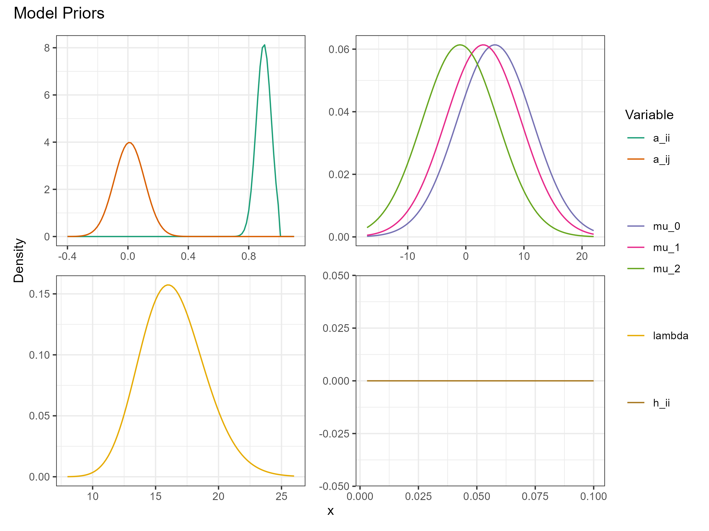


## Question 2

The sampling strategy will be a Gibbs sampler. I'll divide the coefficients into groups that naturally align together.

1. Sample $\beta$ from its full conditional posterior (FCP). Given the other parameters, the dynamic NS model is a linear Gaussian state space model, and $\beta$ can be easily sampled using this knowledge.
2. Sample $A, Q, \mu$ jointly, from their FCP. The three parameters make up the rest of unknowns in the second equation of the DNS model.
3. Sample $H$ from its FCP. Given that $H$ and $\lambda$ joint distributions are not trivial, the strategy is to sample them separately.
4. Sample $\lambda$ from its FCP. After sampling $H$, the last parameter to be sampled is $\lambda$.


### Sampling $\beta$

The sampling is done by the function `sample_beta`. Given that the DNS model, conditional on all other parameters, is a linear Gaussian state space model, the function uses filtering and smoothing to create a sample for $\beta$.

Consider the usual notatins for filtered/smoothed means and variances. Then, after initializing an empty container $\hat \beta$ for the betas, a loop $i \in \{T - 1, \dots, 1\}$ is done.

It calculates, in order, the predictive variance, then mean, then the conditional mean and variance, finally sampling the betas with the conditional values:

$$
\begin{array}{l}
S_{i+1i}=\Phi S_{i i}\Phi^{\mathsf{T}}+Q\\
\beta_{i+1i}=\mu+{\Phi(\beta_{i i}-\mu)}\\
m_{i}=\beta_{i\vert i}+S_{i\vert i}\Phi^{\dag}S_{i+1\vert i}^{-1}(\hat{\beta}_{i+1}-\beta_{i+1\vert i})\,\\
v_{i}=S_{i\vert i}-S_{i\vert i}\bar{\Phi}^{\top}S_{i+1\vert i}^{-1}\Phi S_{i\vert i}\\
{\hat{\beta}}_{i}\sim{\mathcal{N}}(m_{i},v_{i})
\end{array}
$$


### Sampling $A, Q, \mu$

The sampling is done by the function `sample_mu_A_Q`, which:

1. Given beta, an initial $A$ is found via OLS (VAR(1) regression), centrando $\beta$ e $lag(\beta)$ com suas médias amostrais.
2. The residuals are stored, and their covariance matrix is calculated.
3. The posterior of $Q$ is $IW$, with the prior's DFs plus the DFs of the VAR(1); and prior's $S$ parameter plus the covariance of the residuals. $Q$ is sampled from that.
4. The posterior for $\mu$ is from the same family, but its parameters are more complicated: the covariance is the "harmonic mean" of the prior's cov. and $Q$ weighted by the number of observations; the mean is the weighted average of the prior's mean, and the likely estimated mean given $A$, each weighted by its associated covariance matrix.
5. With a draw of $\mu$, it is possible to find $\beta$ and $lag(\beta)$ centered based on $\mu$, instead of sample means.
6. The covariance of $A$ will come from the average between its prior and the covariance of $lag(\beta)$. Its mean is calculated based on the covariance between $lag(\beta)$ and $\beta$. After that, $A$ is sampled from the conjugate posterior (via `sample_A`). This sampling is performed until the stationarity condition is satisfied, using a `while(any(abs(eigen(A)$values) >= 1))` loop.


### Sampling $H$

The sampling is done by the function `sample_H`, which:

1. Initializes empty containters, and calculates $\Lambda$ given $\lambda$.
2. For each maturity, calculates the residuals of true yield minus the fitted yield from DNS (given beta).
3. Samples $H$ from conjugated posterior, with shape ($sh$) $sh' = sh + T/2$ and scale ($sc$) $sc' = sc + 0.5 * SSR$.


### Sampling $\lambda$

The sampling is done by the function `sample_lambda`, via Metropolis Hastings, which:

1. Proposes a new $\lambda$ adding normal noise to the previous $\lambda$, with a small standard deviation.
2. Compares the log likelihood of the new and old $\lambda$, using the ratio as the rate of acceptance $\alpha$.


### Gibbs Loop

An empty container for the parameter vector $\theta$ is initialized and filled with the initial values, the averages of the priors' distributions.

Then, the Gibbs loop updates the parameter vector of each iteration, while using itself as the input for every new sampling block:

```r
for (iter in 2:n_iter) {
  data_theta[[iter]]$beta <- sample_beta(data_yields, data_theta[[iter]])
  data_theta[[iter]][c("mu", "A", "Q")] <- sample_mu_A_Q(data_yields, data_theta[[iter]])
  data_theta[[iter]]$H <- sample_H(data_yields, data_theta[[iter]])
  data_theta[[iter]]$lambda <- sample_lambda(data_yields, data_theta[[iter]])
}
```

Then, `n_burnin` samples are dropped from all the `n_iter`, as to avoid dependence on the initial values.


## Question 3

The implementation is in the file "ps2_main.R". Unfortunately, the algorithm varied a lot in its success rate at each random draw. Lots of times, the algorithm would generate explosive $Q$ matrix, even with $A$ matrix being consistently stationary. This is a major issue for which I could not find result. The results considered here for the diagnostics are based on successful runs, which had to be ran with some non-explosion interferences and stored separately, yielding not-perfect reproducibility.

Additionally, not many iterations were ran, with only $1500$ total and $500$ burn in. This is not ideal, and some parameters might not converge, but I was constrained computationally.

For each parameter (or at least some entries of its matrix), we plot the traceplot, the histogram, and the ACF.

The traceplot is to check convergence general observations, ACF to check dependence, and histogram to check the distribution of the posterior, which should be close to the conjugated posteriors (i.e. same family from the priors) in most cases.


### Lambda Diagnostics


The value of lambda does not seem to converge with, which could be a side effect of the low number of observations. It is one of the hardest parameters to sample.

With it, its distribution is not stable, and very dependent. Overall very problematic.


### Mu Diagnostics

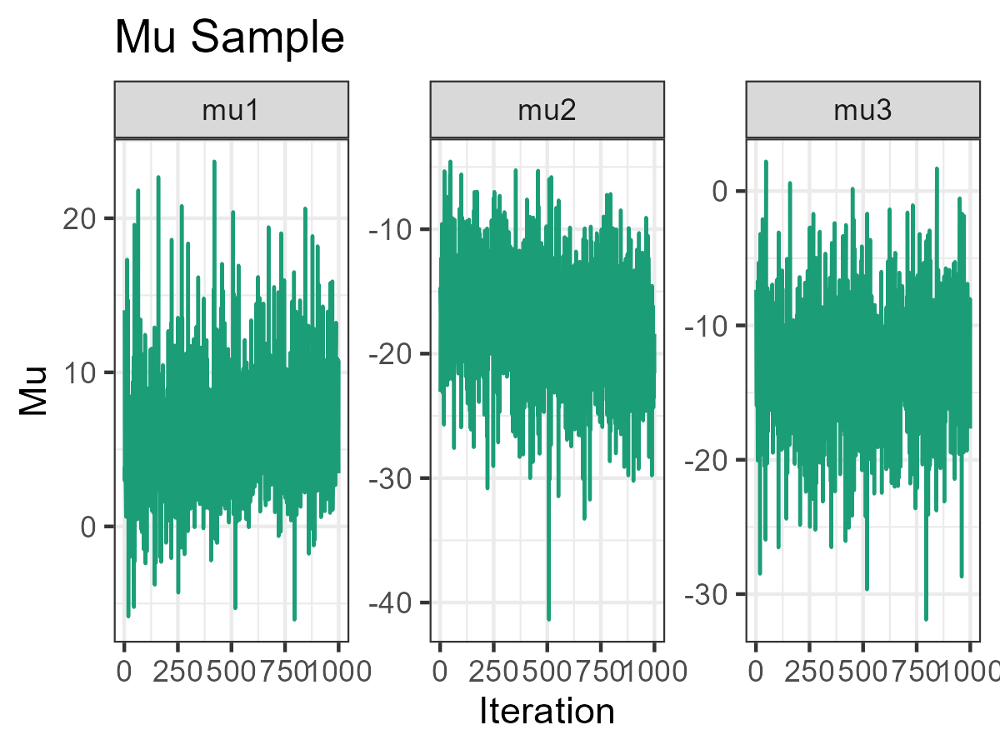

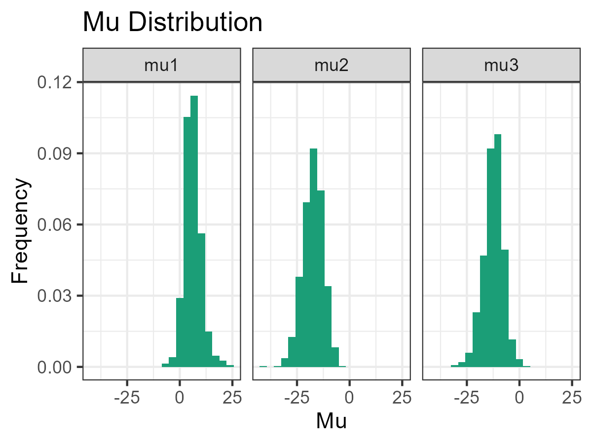

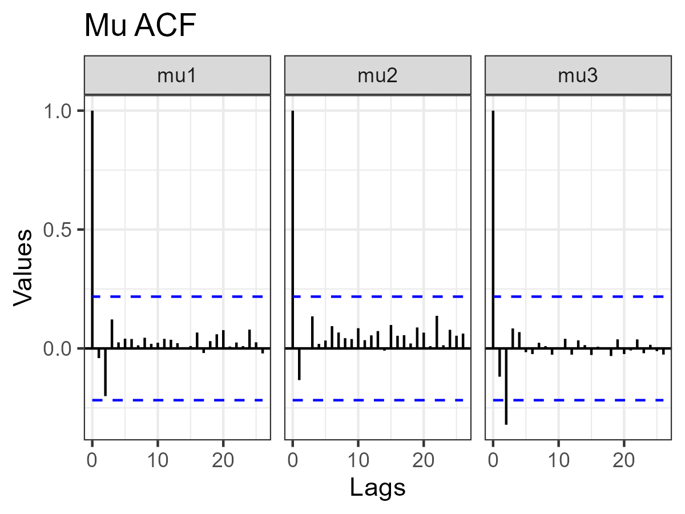

The $mu$ parameter was better. It still seems to gave some tendency, but overall is very low dependent and good convergence. The distribution is close to normal.


### A Diagnostics

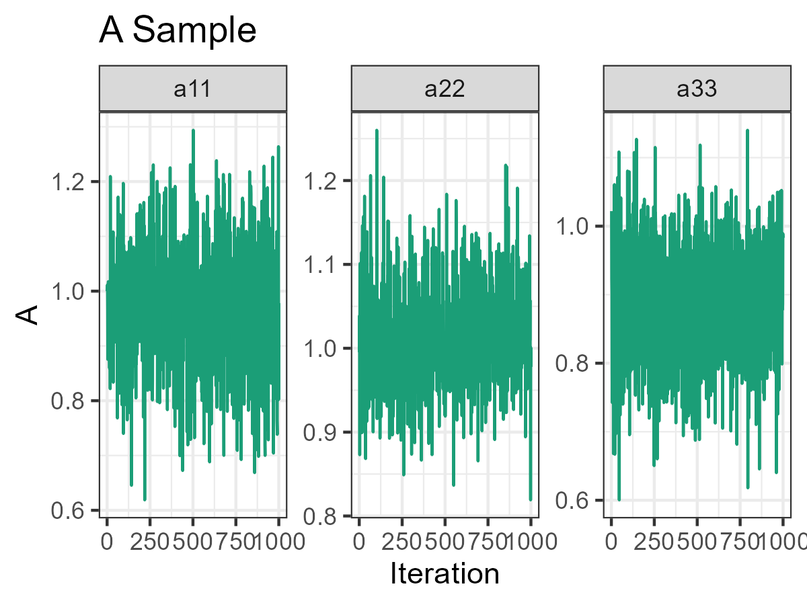

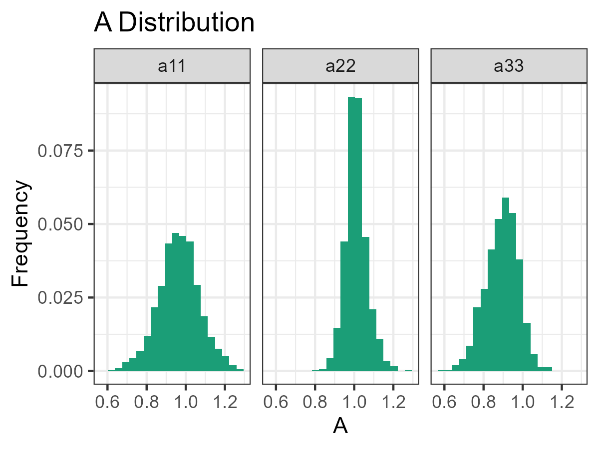

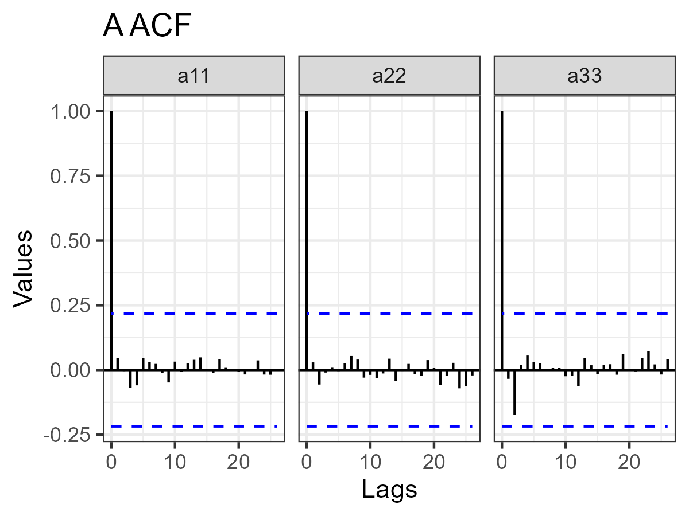

The same comments for $mu$ apply here, with overall good results.


### H Diagnostics

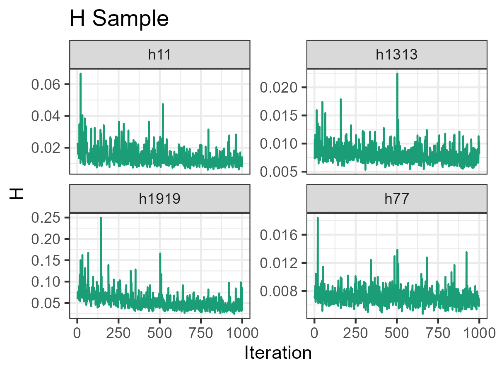

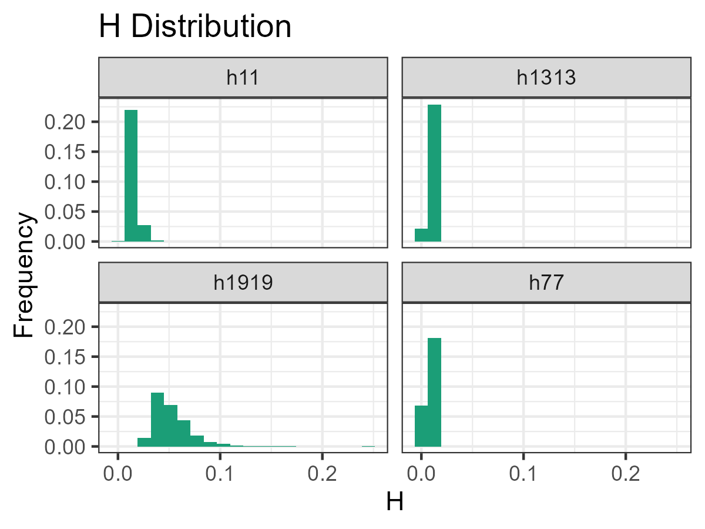

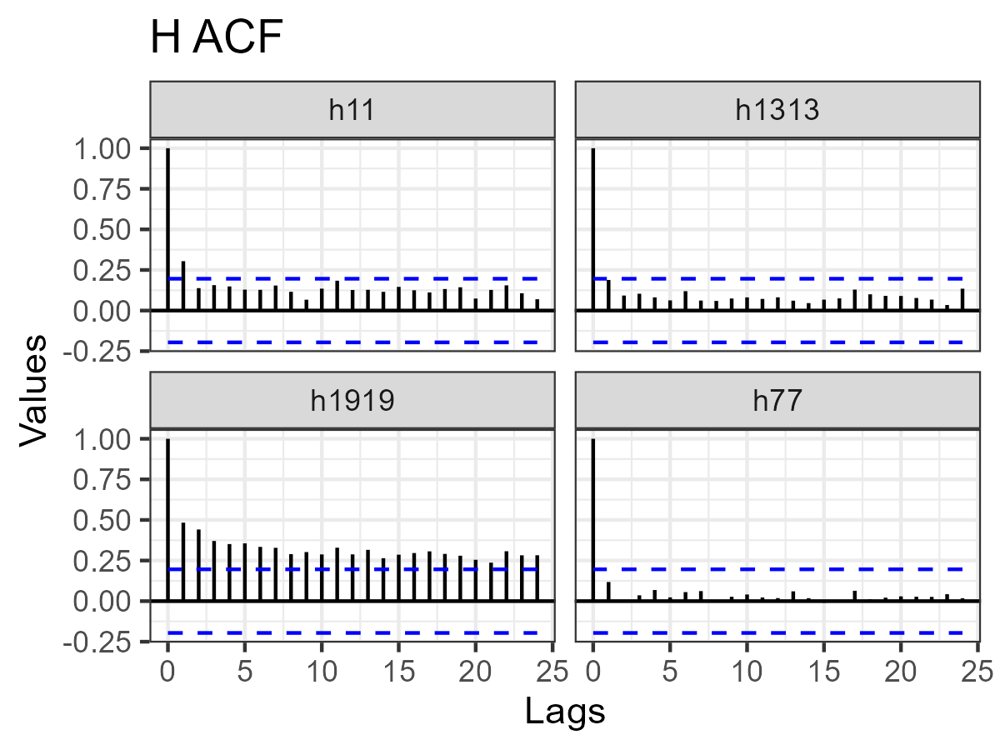

The $H$ sample have some decent match with gamma shape in its distribution, and decent convergence. But, the sample is dependent and present some unwanted patterns. The posterior distribution also present very low variance, less than expected.


### Q Diagnostics


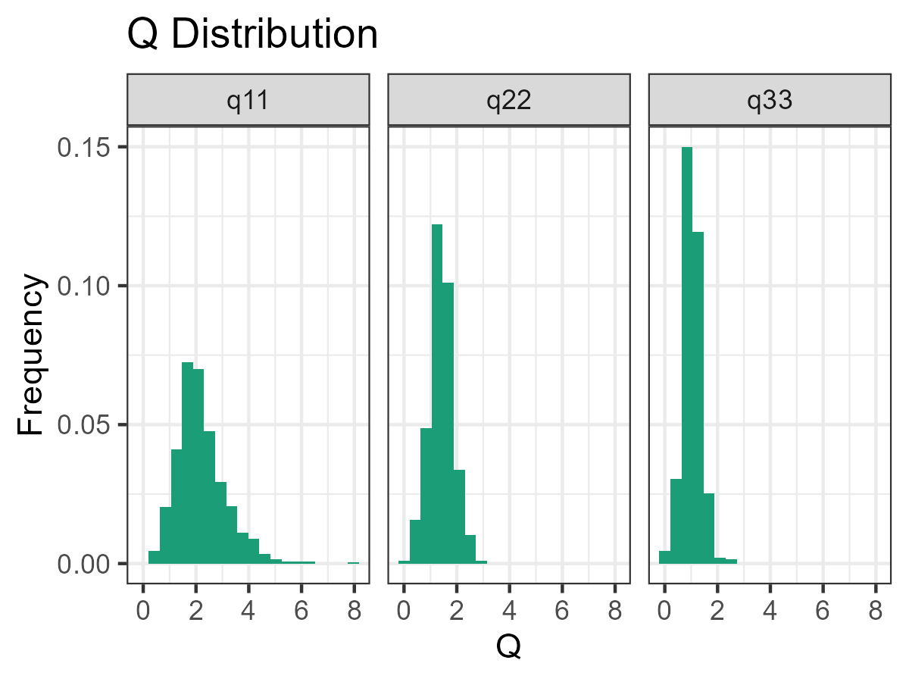

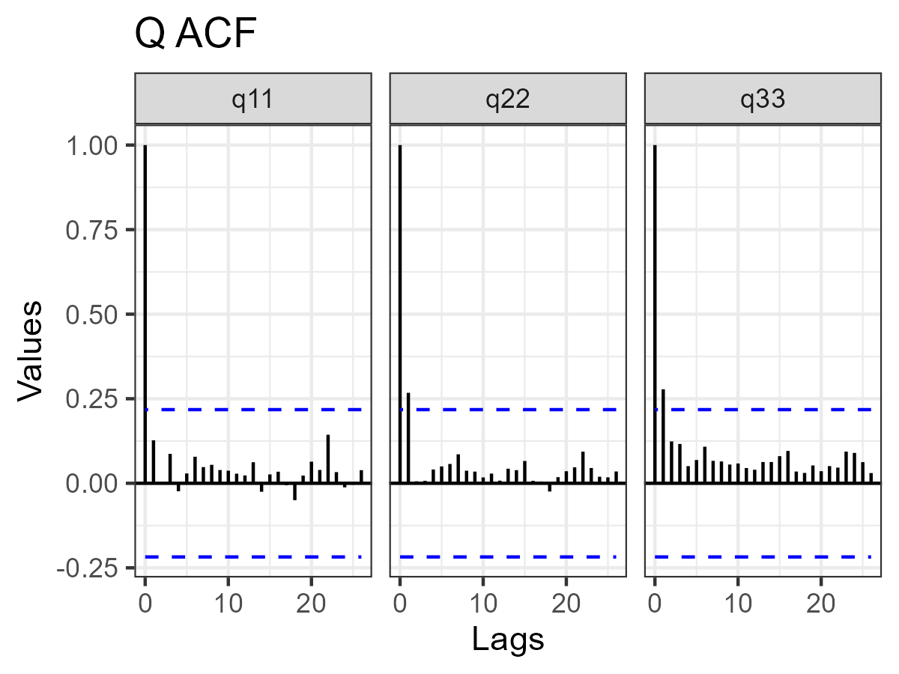

The $Q$ sample is similar to $\mu$ and $A$, but with an less optimal dependence, while still acceptable.


### Full A Diagnostics

Then, the full A diags:

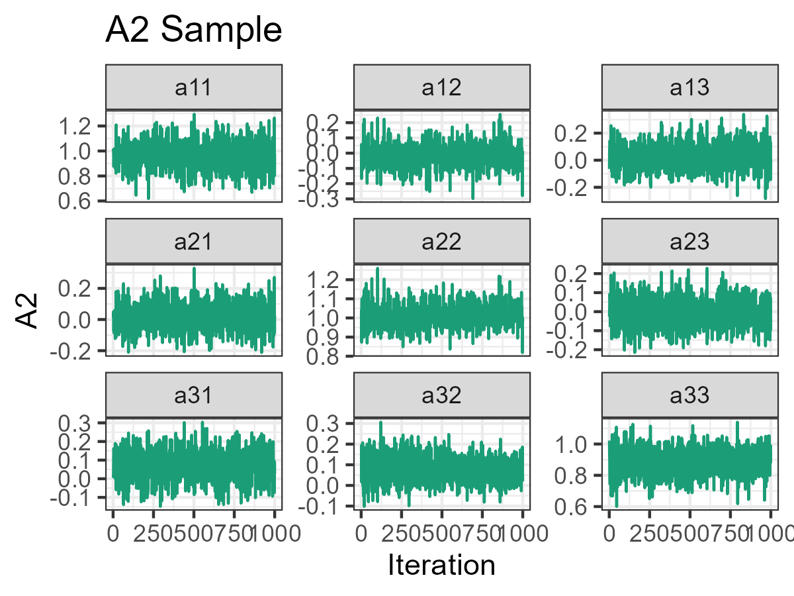

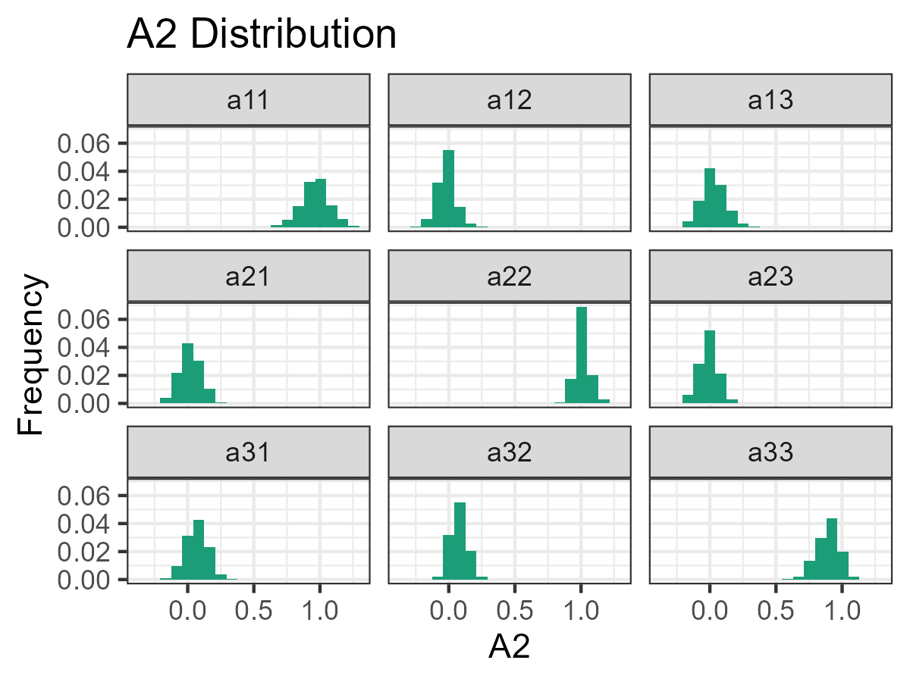

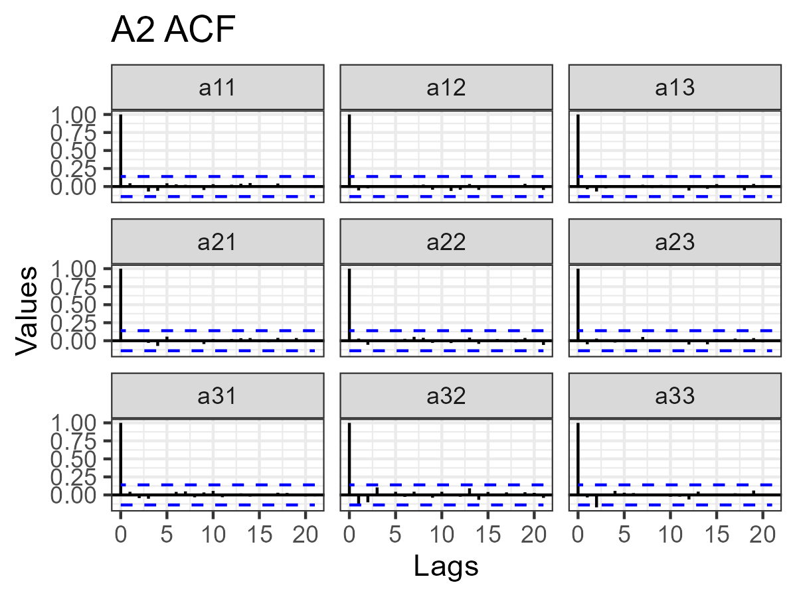
