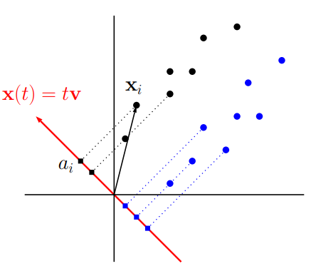

# Introduction

The topic of macroeconomic regime identification is important, as many time series processes have patterns that change over time. While time-varying parameter models are useful, they are harder to estimate, whereas sometimes regimes can be clearly divided. In those cases, they often have useful interpretations for portfolio management, such as high and low volatility, growth and recession, etc.

The authors of [@Akioyamen2020] claim that the literature on regime detection is more focused on traditional statistical methods, but little combines supervised and unsupervised learning. Their proposed methodology combining both approaches is interesting but could benefit from a clearer goal and more thorough data and modeling decisions. In this replication, I intend to reproduce the results of the paper and fill that gap.

The code, data, and typesetting scripts can be found [in my GitHub](https://github.com/ricardo-semiao/task-masters/tree/main/statistical-learning).

## Overview of the Paper

The authors utilize a PCA-based dimensionality reduction approach followed by clustering to detect regimes in the US economy. Then, they create classification models to predict these regimes, arguing that this second step yields a method agnostic on how the regimes were defined in the first step.

Then, they interpret the regimes and discuss portfolio strategies that would benefit from the regime identification. Using the classifiers, they backtest the strategies to test-drive their methodology.

The data is daily percentage changes of macroeconomic variables from the Federal Reserve Economic Data (FRED) database, on the window from 1994 to 2020. The variables are not clearly defined, but their topics are discussed in section 3 of the paper.

## General Comments

The paper could benefit from more discussion on some topics. They are better described in the referee report, but here, I outline them:

1. A clearer goal should be set. Is the idea to find agnostic, generalist, macroeconomic regimes? Or to find 'specialized' regimes that maximize the returns of possible strategies? In this replication, I'll focus on the first.
2. Their dataset is poorly described. I'll create a new one, with a balanced set of variables across the US economy sector.
3. There was little discussion on data analysis (outliers, stationarity) and why all the data was transformed into percent changes. I'll study which variables have more information at their levels, amongst the stationary ones.
4. There was no discussion on the hyperparameter tuning of the models.
5. The reported performance was the in-sample one, a poor practice. Additionally, the paper tests the strategies with all the classification models. I will employ a more realistic/practical approach and stick to the best out-of-sample performing method.
6. Finally, for a proper test of the method, a more systematic approach of backtesting strategies should be used. This won't be tackled in this replication.

# Data

## New Dataset

As discussed, the authors did not provide a clear description of the dataset. I'll create a better-described one, while also defining a comprehensible grouping of macroeconomic variables and balancing the number of variables across them.

The full description can be seen in the appendix.

### Variable Groups and Restrictions

The groupings considered were:

- **Government securities:** yield curve, FED rate, inflation-indexed securities, expected yields.
- **Government monetary policies:** repurchase agreements.
- **Bank borrowing:** overnight rates, discount window primary credit.
- **Bank lending:** prime loan rate, commercial paper rates.
- **Bond markets:** ICE BofA corporate indexes.
- **Stock markets:** S&P500, NASDAQ, DJ, and CBOE volatility indexes.
- **Currency markets:** dollar indexes, dollar vs. other currencies, cryptocurrencies.
- **Money:** M1, inflation expectations.
- **Commodities:** oil, gold, gas, and propane.
- **Recession indicators**: NBER recession dates.

Other groups could have been considered, such as specific markets (labor, real estate, energy, etc.), international trades/investment markets. They weren't to avoid much distancing from the original paper.

Additionally, more thought on balancing could be done. There might be too many very similar yield curve and corporate index variables.

To construct the dataset, I've considered the following restrictions:

- Mainly FRED data, to align with the paper. With specially important variables, Yahoo Finance was used.
- Only currently existing variables, for an updated dataset. The window start was set at 2007/01/03, considering the figure @fig-nas, discussed below.
- Variables with too many missing values, or with long spells of missing variables were removed.

### Missing Values Handling

Figure @fig-nas presents the first date, proportion of missing values (NAs), and the maximum spell of NAs, respectively, for each variable.

{#fig-nas}

The policy variables of repurchase agreements were deemed less relevant and dropped due to the high proportion of NAs. Some superfluous government and bond securities were dropped due to high spells of NAs.

Less relevant variables such as cryptocurrencies and FED rate target range were dropped due to their recency. More important ones such as bank lending ones were proxied by Discount Window Primary Credit, and S&P500 was switched to Yahoo Finance data.

Full comments are on the "data.R" code file.

With the remaining dataset, missing values were imputed with the last observed value, as the authors did, based on it being the last information of an investor.

The new window is 03/jan/2007 to 09/apr/2025, with 4826 observations.

### Data Transformation

Plots of the historic values, histogram, and ACF of all variables were done[^varr]. They are in code file "data.R" but are not included here to avoid pollution.

[^varr]: Via my own package [varr](https://ricardo-semiao.github.io/varr/).

As discussed, some variables carry information on the level: inflation expectations, recession indicators, FED volume, etc. The subset of those that passed an ADF test[^adf] were kept untransformed. The rest was transformed with percent changes, as the authors did.

[^adf]: With only a drift, with lag selected by BIC up to 32 lags.

Finally, the dataset was transformed into train and test, following the same train proportion as the authors, $5051 / (5051 + 1574) \approx 0.76$.

# PCA and Regime Clustering

## PCA

In PCA the variables are standardized, and the SVD decomposition yields components orthogonal to each other. For standardization, variables need to be stationary, hence the importance of the transformation step.

The paper used 26 components to explain 90% of the variance. In the replication, with double the variables, 32 were used.

::: {#fig-pca layout="[1,-0.1,1]" fig-cap="Comparison of PCA results"}

:::

The main components explain more variance in the replication, which probably is due to the higher dependent untransformed variables, that end up having more variance explained. The lower end of the components have less variance explained, which could be related to the many similar variables included.

## Clustering

### The K-Means Model

The regime detection is done by K-Means. The algorithm explanation is in the appendix.

As our goal is to find generalist regimes, the hyperparameters were left as the default mean centroid and Euclidean distance, as the authors probably used.

### The Number of Clusters

The authors wanted to passively select it, to add to their agnosticism claim. I do the same. The authors use the average silhouette width method. Its algorithm is described in the appendix.

The authors choose $k \in \{1, \dots, 6\}$ that maximizes the average silhouette width across all observations.

The silhouette plot for the original paper and the replication is shown below. Both have their maxima at $k = 2$.

::: {#fig-pca layout="[1,-0.1,1]" fig-cap="Comparison of silhouette results"}

:::

Note that $k = 2$ is useful since $k > 2$ would require multinomial classification methods.

## Final Regimes

The authors analyze the regime-colored two principal components via @fig-regimes[^scale-correction].

[^scale-correction]: Note the more appropriate discrete color scale.

::: {#fig-regimes layout="[1]" fig-cap="Comparison of the regimes"}

:::

They interpret that the second half of the 2000–2002 dot-com bubble and the 2007–2009 financial crisis are captured in regime 2, while regime 1 coincides with non-crisis periods.

In the replicated regimes, the 2008 crisis is also captured in regime 2 but not the initial COVID crisis, for example.

We can also see the effect of the higher dependent untransformed variables giving rise to a higher dependent first component.

# Regime Classification

## Considered Models

The K-Means algorithm can classify new data, assigning the cluster of the closest centroid. But, the authors' approach is agnostic to the clustering method.

The authors trained the models: logit; LDA and QDA; decision tree; AdaBoost; and naive Bayes. The algorithms are described in the appendix.

Some models' tuning options were expected to have small effect, such as Laplace smoothing for NB, Gaussian CDF instead of Logistic for logit; or were very additional, such as covariance matrix regularization for LDA and QDA. On top of that, `rpart`'s implementation of Trees allows basically for index selection (Information or Gini), and `JOUSBoost` automatically chooses the number of rounds via cross-validation. Thus, hyperparameter tuning was taken as not a priority, and the default values were used. This has the additional benefit of a more similar approach to the original paper.

## Model Selection

The models are fitted with the selected principal components for the training window.

10-fold cross-validation is used to assess model performance. The authors present the in-sample results, which was not ideal.

The metrics that the authors considered were accuracy, F1-Score, and AUC. They are defined in the appendix. In the code, I also defined the more elementary TPR, TNR, PPV, and NPV, but did not report them in the results.

The comparison of the metrics is shown below. Note how much more informative are the out-of-sample metrics.

::: {#fig-model-performance layout="[1,-0.1,1]" fig-cap="Comparison of the models' performance"}

:::

## Predicted Regimes

The authors do not show the predicted regimes, which would've been useful to understand the models' results. For the replication, they are shown in figure @fig-predicted-regimes, for the LDA and decision tree model, respectively.

::: {#fig-predicted-regimes layout="[1]" fig-cap="Comparison of the predicted regimes' performance"}

:::

Both present very similar predictions. We can see a much higher frequency of switches than in the training sample. This is important as too frequent switches could lead to overtrading in some strategies.

# Backtest Strategies

## Considered Strategies

The paper considers three strategies:

- **Buy and Hold:** a passive, benchmark strategy. Done for Oil and S&P 500.
- **Tail-hedging:** holding a long position of the asset during regime 1, and short during regime 2, or vice versa. Done for oil and S&P 500.
    - Useful for variables whose return has negative (or positive) correlation with the regime.
- **Tactical allocation:** a 60%/40% position on S&P 500 and US Treasury bonds during regime 1, and 50% short of S&P 500, oil plus 50% long gold and US treasury during regime 2.

The authors show all of the results for all models, whereas I'll only show the best-performing model, LDA. The idea is that an investor, without backtesting information, would only have the performance metrics to choose the model. With the much more informative and different out-of-sample metrics, considering all the models makes less sense.

Given the goal of the replication, I won't spend much time talking about the finance characteristics of the strategies in themselves, but rather the relationship of their performance with the predicted regimes.

## Buy and Hold

First, the benchmark strategy results:

::: {#fig-predicted-regimes layout="[1]" fig-cap="Comparison of the buy and hold strategy performance"}
{width=80%}

{width=80%}
:::

## Tail-Hedging

In the replication, I added security and cluster information. This is a needed addition to understand how the clusters are contributing for the portfolio performance. In the tail hedging strategy, we wan't to be able to identify positive returns more frequent in regime 1, and negative returns in regime 2 (or vice versa).

The comparison of the strategies for S&P 500 (GSPC) is in figure @fig-tail-sp, and for oil (DCOILWTICO) in @fig-tail-oil.

::: {#fig-tail-sp layout="[1,-0.1,1]" fig-cap="Comparison of the tail hedging with S&P 500"}

:::

::: {#fig-tail-oil layout="[1,-0.1,1]" fig-cap="Comparison of the tail hedging with crude oil"}

:::

In the series' plots, we observe more positive returns in regime 1 for oil, and negative returns in regime 2, which explains its good performance. However, the same pattern is not evident for the S&P 500. The performance metrics for the original paper and replication are shown in figure @fig-tail-performance.

::: {#fig-tail-performance layout="[1]" fig-cap="Comparison of the tail hedging strategy performance"}

:::

## Tactical Allocation

The tactical allocation returns are shown in figures @fig-tactical-original and @fig-tactical-rep. In both cases, the performance is less stable, with significant highs and lows. This could be attributed to the higher number of securities involved. A comparison of performances is presented in figure @fig-tactical-performance.

{#fig-tactical-original width=50%}

{#fig-tactical-rep}

::: {#fig-tactical-performance layout="[1]" fig-cap="Comparison of the tactical allocation strategy performance"}

:::

# Conclusion

The paper uses an interesting mix of models in its hybrid approach, yielding good results of regime detection and classification.

Several poor practices and modeling decisions could have been better explained. I tried to partially fill that in the replication.

Some strategies, especially tail-hedging, presented very different results, which could show inconsistency.

Good coding and data setup, more novelty on the replication would be nice:

- More variables: better balance the dataset, find other sources for dropped variables, etc.
- More classification models and metrics, with better diagnosis.
- More strategies, in a more systematic way, so as to properly test drive the approach.

# References {.unnumbered .unlisted}

::: {#refs}
:::



\addtocontents{toc}{\protect\setcounter{tocdepth}{-1}}
\setcounter{section}{0}
\renewcommand{\thesection}{\Alph{section}}

# Appendix: Algorithm Descriptions

## Clustering Model

### K-Means

Let the data be the sequence of observations $(x_t)_{t = 1}^T$, with $d$ variables, i.e. $x_t \in \mathbb{R}^d,~ \forall t$.

Given a value of $k \in \mathbb{N}$, the goal of K-Means is to choose the sets $S = \{S_1, \dots S_k\}$ that minimizes the within-cluster sum of squares:

$$
\text{argmin}_{S} \sum_{i = 1}^k \sum_{x \in S_i} \Vert x - \mu_i \Vert, ~~~ \mu_i = \frac{1}{|S_i|}\sum_{x \in S_i} x
$$

Besides $k$, the functional form of the _centroid_ $\mu_i$ and the distance measure $\Vert . \Vert$ are hyperparameters.

### Silhouette

Fix some data point $x \in S_i$. Let $a(x)$ be the average distance of $x$ and its cluster; and $b(x)$ the average distance of the second nearest cluster:

$$
a(x) = \frac{1}{|S_i| - 1}\sum_{y \in S_i,~ x \neq y} d(x, y), ~~~~ b(x) = \min_{S_j \neq S_i} \frac{1}{|S_j|}\sum_{y \in S_j} d(x, y)
$$

The silhouette of $x$ is defined as:

$$
s(x) = \frac{b(x) - a(x)}{\max\{a(x), b(x)\}}
$$

Observations with low silhouette are not very well separated.

## Classification Models

### Logit

Given an observation, let $y \in \{0, 1\}$ denote its regime and $\pmb{x}$ its covariates.

The logit model predicts the probability of $y = 1$ given $\pmb{x}$ as:

$$
y = f(\beta_0 + \beta\pmb{x}) + e_t
$$

Where $f$ is the logistic function. The parameters $\beta_0, \beta$ are chosen minimizing the sum of squared residuals. The predicted class is the rounded probability.

In R, the method is implemented via `glm()`, following standard GLM.

### QDA

Assume normality of the data. Estimate $\mu_k = E[X|y = k]$ and $\Sigma_k = Cov(\pmb{x}|y = k)$.

Then, we can use the Gaussian PDF to find the likelihood of $y = 0$ and $y = 1$.

Quadratic discriminant analysis classifies $y = 1$ if the likelihood ratio $L(y=1)/L(y=0)$ is larger than some threshold $t$. Geometrically, it can be shown that that is equivalent to a quadratic surface separating the classes.

### LDA

Linear discriminant analysis assumes $\Sigma_0 = \Sigma_1$, which simplifies the problem into a linear surface.

Behind the scenes, the model searches for the space where the projected data is the most separated $|\mu_1 - \mu_0|$, normalized by the sum of variances.

{width=30%}

The authors do not apply the Bartlett's test to check if the covariances matrices are equal, i.e. if LDA or QDA is more appropriate. Doing that, LDA seems to be sufficiently appropriate.

In R, the method is implemented in the `MASS` package, following Venables and Ripley (2002).

### Decision Tree

Decision trees are a combination of nodes $j \in \mathbb{J}$. At each node, the data is partitioned into subsets via rules of the form $x_{s_j} \leq c_j$, $x_{s_j} \in \pmb{x}$.

Let $m \in \mathbb{T}$ denote the terminal node reached by $\pmb{x}$, and $\mathcal{R}_k$ denote the set of terminal nodes related to $y = k$. Then:

$$
y = \sum_{k = 0}^1\beta_k I\{\pmb{x} \in \mathcal{R}_k\} + e_t = \sum_{k = 0}^1\beta_k \prod_{j \in \mathbb{J}_m}I\{x_{s_j} \leq c_j\} + e_t
$$

Where $\mathbb{J}_m$ is the set of nodes leading to $m$. The parameters $c_j, s_j$ are estimated by minimizing the sum of squared residuals, then again, until the SSR is above a desired value.

In R, the method is implemented the `rpart` package, following Breiman et. al. (1984).

### AdaBoost

AdaBoost is a boosting algorithm for weak classifiers. The authors do not specify, but I assumed a decision trees pairing.

The ensemble to be formed, with $T$ iterations, is $H_T(\pmb{x}) = \sum_{t = 1}^T \alpha_t h_t(\pmb{x})$.

It is built iteratively, updating (correcting) the fits of the last iterations at each step: $H_t(x) = H_{t-1}(x) + \alpha_t h_t(x)$

The weak learner $h_t$ and the parameter $\alpha_t$ are selected at each iteration to minimize the training error.

In R, the method is implemented the `JOUSBoost` package, following Freund and Schapire (1997).

### Naive Bayes

Naive Bayes assumes that the features are conditionally independent, within each class. That is, no information shared between the predictors. This is unrealistic but implies in a simple estimation.

The prior for $p(y = k)$ is set. The authors did not specify, but I assumed $1/\sum I\{y = k\}$.

Then, this prior is updated via the Bayes theorem: $p(y = k|\pmb{x}) \propto p(\pmb{x}| y = k) * p(y)$.

The authors did not specify, but I assumed a Gaussian distribution for the likelihood $p(\pmb{x}| y = k)$. It can match the percent change transformation well, but maybe not the levels, untransformed data possibly should be handled differently.

The model then predicts $y$ via:

$$
\text{argmax}_y p(y) \prod p(\pmb{x}|y)
$$

In R, the method is implemented the `naive_bayes` package.

## Classification Metrics

Let TP, TN, FP, FN be the number of true positives, etc. Let $\pi_0$ be the threshold probability that defines $y = 1$.

Let T/FPR be the true/false positive rates $\frac{TP}{TP + FN}$ and $\frac{FP}{FP + TN}$.

Then, the considered metrics were:

- Accuracy: $\frac{TP + TN}{TP + TN + FP + FN}$, a measure of overall performance.
- F1-Score: $\text{Harmonic}\left(\frac{TP}{TP + FP}, \frac{TP}{TP + FN}\right)$, an average measure on how trustworthy are the model's 'positives'.
- AUC: $\int_0^1 TPR(FPR(\pi_0)) dFPR$, a measure of the trade-off between TPR and FPR.



# Appendix: Data Selection

The full description of the dataset can be seen below. Keep in mind that some of the variables were dropped or brought in from Yahoo Finance instead.

## Government Securities

Variables related to government securities, sold to the whole economy. Mainly:

- Investment quotes of treasury securities, at $x$-Year constant maturity, $x$ being 1 month, or 1, 5, 10, or 30 years.
- The same above, but for inflation-indexed securities.
- Secondary market rates for treasury bills, at 1, 3, 6, and 12 months.
- 10-Year constant maturity rates minus 2-Year, 3-Month, and FED Funds Rate. 5-Year constant maturity rates minus FED Funds Rate.
- FED Funds target range, effective rate, and volume.

| Code     | Description                                                               | Unit                     |
|----------|---------------------------------------------------------------------------|--------------------------|
| DFEDTARL | Federal Funds Target Range - Lower Limit                                  | Percent                  |
| DFEDTARU | Federal Funds Target Range - Upper Limit                                  | Percent                  |
| DFF      | Federal Funds Effective Rate                                              | Percent                  |
| EFFRVOL  | Effective Federal Funds Volume                                            | Billions of U.S. Dollars |
| DFII10   | Market Yield on U.S. Treasury Securities at 10-Year Constant Maturity     | Percent                  |
| DFII30   | Market Yield on U.S. Treasury Securities at 30-Year Constant Maturity     | Percent                  |
| DFII5    | Market Yield on U.S. Treasury Securities at 5-Year Constant Maturity      | Percent                  |
| DGS1     | Market Yield on U.S. Treasury Securities at 1-Year Constant Maturity      | Percent                  |
| DGS10    | Market Yield on U.S. Treasury Securities at 10-Year Constant Maturity     | Percent                  |
| DGS1MO   | Market Yield on U.S. Treasury Securities at 1-Month Constant Maturity     | Percent                  |
| DGS30    | Market Yield on U.S. Treasury Securities at 30-Year Constant Maturity     | Percent                  |
| DGS5     | Market Yield on U.S. Treasury Securities at 5-Year Constant Maturity      | Percent                  |
| DTB1YR   | 1-Year Treasury Bill Secondary Market Rate, Discount Basis                | Percent                  |
| DTB3     | 3-Month Treasury Bill Secondary Market Rate, Discount Basis               | Percent                  |
| DTB4WK   | 4-Week Treasury Bill Secondary Market Rate, Discount Basis                | Percent                  |
| DTB6     | 6-Month Treasury Bill Secondary Market Rate, Discount Basis               | Percent                  |
| T10Y2Y   | 10-Year Treasury Constant Maturity Minus 2-Year Treasury Constant         | Percent                  |
| T10Y3M   | 10-Year Treasury Constant Maturity Minus 3-Month Treasury Constant        | Percent                  |
| T10YFF   | 10-Year Treasury Constant Maturity Minus Federal Funds Rate               | Percent                  |
| T5YFF    | 5-Year Treasury Constant Maturity Minus Federal Funds Rate                | Percent                  |

## Government Securities Expectations

Expectation-related variables on government securities. Mainly:

- Fitted yields on zero coupon bonds, at 1, 5, and 10 years.
- Fitted instantaneous forward rates, at 1, 5, and 10 years.
- Term premiums on 1, 5, and 10 year zero coupon bonds.
- Instantaneous forward term premiums on 1, 5, and 10 year zero coupon bonds.

| Code         | Description                                      | Unit    |
|--------------|--------------------------------------------------|---------|
| THREEFY1     | Fitted Yield on a 1 Year Zero Coupon Bond        | Percent |
| THREEFY10    | Fitted Yield on a 10 Year Zero Coupon Bond       | Percent |
| THREEFY5     | Fitted Yield on a 5 Year Zero Coupon Bond        | Percent |
| THREEFYTP1   | Term Premium on a 1 Year Zero Coupon Bond        | Percent |
| THREEFYTP10  | Term Premium on a 10 Year Zero Coupon Bond       | Percent |
| THREEFYTP5   | Term Premium on a 5 Year Zero Coupon Bond        | Percent |
| THREEFF1     | Fitted Instantaneous Forward Rate 1 Year Hence   | Percent |
| THREEFF10    | Fitted Instantaneous Forward Rate 10 Years Hence | Percent |
| THREEFF5     | Fitted Instantaneous Forward Rate 5 Years Hence  | Percent |
| THREEFFTP1   | Instantaneous Forward Term Premium 1 Year Hence  | Percent |
| THREEFFTP10  | Instantaneous Forward Term Premium 10 Years Hence| Percent |
| THREEFFTP5   | Instantaneous Forward Term Premium 5 Years Hence | Percent |

## Overnight Bank Borrowing

Variables related to borrowing between banks, and between banks and government, normally to meet reserve requirements. Mainly:

- Secured Overnight Financing rate and index.
- Overnight Bank Funding rate and volume.
- AMERIBOR rate.
- Discount Window Primary Credit Rate.
- Interest Rate on Reserve Balances.

| Code      | Description                                     | Unit                     |
|-----------|-------------------------------------------------|--------------------------|
| AMERIBOR  | Overnight Unsecured AMERIBOR Benchmark Interest Rate | Percent                  |
| SOFR      | Secured Overnight Financing Rate                | Percent                  |
| SOFRINDEX | SOFR Index                                      | Index Apr 2, 2018 = 1    |
| OBFR      | Overnight Bank Funding Rate                     | Percent                  |
| OBFRVOL   | Overnight Bank Funding Volume                   | Billions of U.S. Dollars |
| DPCREDIT  | Discount Window Primary Credit Rate             | Percent                  |
| IORB      | Interest Rate on Reserve Balances (IORB Rate)   | Percent                  |

## Commercial bank lending

Variables related to commercial banks securities, sold to the whole economy. Mainly:

- Bank Prime Loan Rate.
- $x$-day financial and non-financial AA Commercial Paper Rates. $x$ being 1, 7, 15, 30, 60, 30, and 90.

| Code              | Description                                           | Unit    |
|-------------------|-------------------------------------------------------|---------|
| DPRIME            | Bank Prime Loan Rate                                  | Percent |
| DCPF1M            | 30-Day AA Financial Commercial Paper Interest Rate    | Percent |
| DCPN3M            | 90-Day AA non-financial Commercial Paper Interest Rate | Percent |
| RIFSPPFAAD01NB    | Overnight AA Financial Commercial Paper Interest Rate | Percent |
| RIFSPPFAAD07NB    | 7-Day AA Financial Commercial Paper Interest Rate     | Percent |
| RIFSPPFAAD15NB    | 15-Day AA Financial Commercial Paper Interest Rate    | Percent |
| RIFSPPFAAD60NB    | 60-Day AA Financial Commercial Paper Interest Rate    | Percent |
| RIFSPPFAAD90NB    | 90-Day AA Financial Commercial Paper Interest Rate    | Percent |
| RIFSPPNAAD01NB    | Overnight AA non-financial Commercial Paper Interest Rate | Percent |
| RIFSPPNAAD07NB    | 7-Day AA non-financial Commercial Paper Interest Rate  | Percent |
| RIFSPPNAAD15NB    | 15-Day AA non-financial Commercial Paper Interest Rate | Percent |
| RIFSPPNAAD30NB    | 30-Day AA non-financial Commercial Paper Interest Rate | Percent |
| RIFSPPNAAD60NB    | 60-Day AA non-financial Commercial Paper Interest Rate | Percent |

## Bond Markets

Variables related to bonds created by firms and sold in the bond market. Mainly:

- ICE BofA XXX US Corporate Index Effective Yield, XXX from AAA to "CCC & lower".
- ICE BofA 1-3, 3-5, 7-10, and 15+ US Corporate Index Effective Yield.
- ICE indexes on emerging markets.

| Code                     | Description                                              | Unit    |
|--------------------------|----------------------------------------------------------|---------|
| BAMLC0A0CM               | ICE BofA US Corporate Index Option-Adjusted Spread       | Percent |
| BAMLC0A0CMEY             | ICE BofA US Corporate Index Effective Yield              | Percent |
| BAMLC0A1CAAAEY           | ICE BofA AAA US Corporate Index Effective Yield          | Percent |
| BAMLC0A3CAEY             | ICE BofA Single-A US Corporate Index Effective Yield     | Percent |
| BAMLC0A4CBBBEY           | ICE BofA BBB US Corporate Index Effective Yield          | Percent |
| BAMLC1A0C13YEY           | ICE BofA 1-3 Year US Corporate Index Effective Yield     | Percent |
| BAMLC2A0C35YEY           | ICE BofA 3-5 Year US Corporate Index Effective Yield     | Percent |
| BAMLC4A0C710YEY          | ICE BofA 7-10 Year US Corporate Index Effective Yield    | Percent |
| BAMLC8A0C15PYEY          | ICE BofA 15+ Year US Corporate Index Effective Yield     | Percent |
| BAMLEMCBPIEY             | ICE BofA Emerging Markets Corporate Plus Index Effective Yield | Percent |
| BAMLEMHBHYCRPIEY         | ICE BofA High Yield Emerging Markets Corporate Plus Index Effective Yield | Percent |
| BAMLH0A0HYM2             | ICE BofA US High Yield Index Option-Adjusted Spread      | Percent |
| BAMLH0A0HYM2EY           | ICE BofA US High Yield Index Effective Yield             | Percent |
| BAMLH0A1HYBBEY           | ICE BofA BB US High Yield Index Effective Yield          | Percent |
| BAMLH0A2HYBEY            | ICE BofA Single-B US High Yield Index Effective Yield    | Percent |
| BAMLH0A3HYCEY            | ICE BofA CCC & Lower US High Yield Index Effective Yield | Percent |

## Stock markets

Variables related to stock market indexes and volatility. Mainly:

- S&P 500, and NASDAQ Indexes.
- Dow Jones industrial, transportation, and utility averages.
- CBOE Volatility Indexes.

| Code   | Description                              | Unit                     |
|--------|------------------------------------------|--------------------------|
| NASDAQCOM | NASDAQ Composite Index                | Index Feb 5, 1971=100    |
| DJIA   | Dow Jones Industrial Average             | Index                    |
| DJTA   | Dow Jones Transportation Average         | Index                    |
| DJUA   | Dow Jones Utility Average                | Index                    |
| SP500  | S&P 500                                  | Index                    |
| VIXCLS | CBOE Volatility Index: VIX               | Index                    |
| VXDCLS | CBOE DJIA Volatility Index               | Index                    |
| VXNCLS | CBOE NASDAQ 100 Volatility Index         | Index                    |

## Policy operations

Variables related to the Federal Reserve's policy operations. Mainly:

- Dollars on repurchase agreements, and reverse repurchase agreements.

| Code             | Description                                                       | Unit                     |
|------------------|-------------------------------------------------------------------|--------------------------|
| RPONTSYD         | Overnight Repurchase Agreements: Treasury Securities Purchased by the Federal Reserve | Billions of US Dollars   |
| RPTMTSYD         | Term Repurchase Agreements: Treasury Securities Purchased by the Federal Reserve | Billions of US Dollars   |
| RPTSYD           | Repurchase Agreements: Treasury Securities Purchased by the Federal Reserve | Billions of US Dollars   |
| RRPONTSYAWARD    | Overnight Reverse Repurchase Agreements Award Rate: Treasury Securities | Percent                  |
| RRPONTSYD        | Overnight Reverse Repurchase Agreements: Treasury Securities Sold by the Federal Reserve | Billions of US Dollars   |
| RRPTMTSYD        | Term Reverse Repurchase Agreements: Treasury Securities Sold by the Federal Reserve | Billions of US Dollars   |
| RRPTSYD          | Reverse Repurchase Agreements: Treasury Securities Sold by the Federal Reserve | Billions of US Dollars   |

## Exchange rate

Variables related to currencies and their exchange rates:

- Bitcoin, Ethereum, and Litecoin.
- US Dollars to Australian Dollar, Canadian Dollar, Hong Kong Dollar, Indian Rupee, Japanese Yen, South Korean Won, and Mexican Peso.
- US Dollars indexes, including advanced foreign economies, broad, and emerging market economies.

| Code       | Description                                      | Unit                     |
|------------|--------------------------------------------------|--------------------------|
| DEXCAUS | Canadian Dollars to U.S. Dollar Spot Exchange Rate | Canadian Dollars to One U.S. Dollar |
| DEXHKUS | Hong Kong Dollars to U.S. Dollar Spot Exchange Rate | Hong Kong Dollars to One U.S. Dollar |
| DEXINUS | Indian Rupees to U.S. Dollar Spot Exchange Rate | Indian Rupees to One U.S. Dollar |
| DEXJPUS | Japanese Yen to U.S. Dollar Spot Exchange Rate | Japanese Yen to One U.S. Dollar |
| DEXKOUS | South Korean Won to U.S. Dollar Spot Exchange Rate | South Korean Won to One U.S. Dollar |
| DEXMXUS | Mexican Pesos to U.S. Dollar Spot Exchange Rate | Mexican Pesos to One U.S. Dollar |
| DEXUSAL | U.S. Dollars to Australian Dollar Spot Exchange Rate | U.S. Dollars to One Australian Dollar |
| DEXUSUK | U.S. Dollars to U.K. Pound Sterling Spot Exchange Rate | U.S. Dollars to One U.K. Pound Sterling |
| DTWEXAFEGS | Nominal Advanced Foreign Economies U.S. Dollar Index | Index Jan 2006=100 |
| DTWEXBGS | Nominal Broad U.S. Dollar Index | Index Jan 2006=100 |
| DTWEXEMEGS | Nominal Emerging Market Economies U.S. Dollar Index | Index Jan 2006=100 |
| CBBTCUSD | Coinbase Bitcoin | U.S. Dollars |
| CBETHUSD | Coinbase Ethereum | U.S. Dollars |
| CBLTCUSD | Coinbase Litecoin | U.S. Dollars |

## Prices

Prices/Indexes of specific commodities. Mainly:

- Crude Oil, Natural Gas, and Propane.

| Code       | Description                                      | Unit                     |
|------------|--------------------------------------------------|--------------------------|
| DCOILWTICO | Crude Oil Prices: West Texas Intermediate (WTI) - Cushing, Oklahoma | Dollars per Barrel       |
| DHHNGSP    | Henry Hub Natural Gas Spot Price                 | Dollars per Million BTU  |
| DPROPANEMBTX | Propane Prices: Mont Belvieu, Texas            | Dollars per Gallon       |
| OVXCLS     | CBOE Crude Oil ETF Volatility Index              | Index                    |

## Inflation

Variables related to the inflation. Mainly:

- 10 and 5 Year Breakeven Inflation Rate.
- 5-Year, 5-Year Forward Inflation Expectation Rate

| Code   | Description                                | Unit    |
|--------|--------------------------------------------|---------|
| T10YIE | 10-Year Breakeven Inflation Rate           | Percent |
| T5YIE  | 5-Year Breakeven Inflation Rate            | Percent |
| T5YIFR | 5-Year, 5-Year Forward Inflation Expectation Rate | Percent |

## Others

Other variables, mainly recession indicators.

| Code                  | Description                                                       | Unit  |
|-----------------------|-------------------------------------------------------------------|-------|
| USARECDM             | OECD based Recession Indicators for the United States from the Peak | +1 or 0 |
| USEPUINDXD           | Economic Policy Uncertainty Index for United States               | Index |
| USRECD               | NBER based Recession Indicators for the United States from the Period | +1 or 0 |
| INFECTDISEMVTRACKD   | Equity Market Volatility: Infectious Disease Tracker              | Index |
