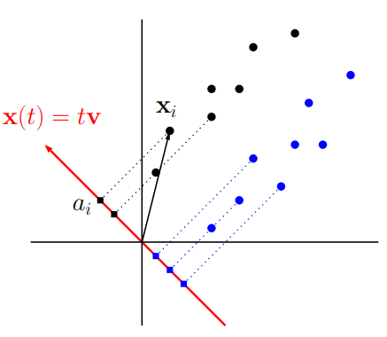

# Introduction

## Motivation

- Many time series process have patterns that change over time.
- Time varying parameter models are useful, but hard to estimate. Furthermore, some patterns can be clearly divided into regimes.
- For financial data, detecting regimes of, for example, high and low volatility, growth and recession, etc. can be useful for portfolio management.
- Lots of research on the topic, but little combining supervised and unsupervised learning.

## Overview

- A PCA + clustering approach to detect regime switches in the US economy.
- A classification approach to predict regimes.
- FRED daily percentage change data, from 1994 to 2020, with 48 variables and 6625 observations.
- Backtesting portfolio strategies based on regime prediction.

## General Comments

- The paper uses a nice combination of techniques, and the hybrid approach is interesting.
- Very short, does not poses itself to explore all the complex modelling decisions, nor to thoroughly test the results.
    - Specially, very poorly described data.
- Lies in a grey area between a methodological paper and an applied one.
- The regime-based strategies generate a goal in an otherwise mainly methodological paper.
- The backtest is useful, but is done only for a few strategies and assets.

## Replication Goal

- **Define a goal:**
    - Define regimes that maximize the performance of its best strategy? The considered strategies and performance metric matters.
    - Define regimes in an 'agnostic' way, that captures patterns of the US as a whole?
- **Create a new dataset:**
    - Authors did not provide information on the data.
    - Variable selection based on the goal: variables that relate to returns, volatility, or more balanced?

I will focus on the second goal.

## Replication Goal

- **Variable transformations:**
    - Discuss more the nature of the data: stationarity and missing values.
    - Variable transformation based on the goal: the information is in the returns, or in the levels?
- Give more thought on model hyperparametrization. Specially with the first goal.
- Think of different strategies based on new data and modelling.
- Compare the results, keeping in mind that the data is different.

## Literature Review

Many regime switching models have been widely used in the finance literature.

Most are supervised, i.e. the regimes are chosen either deterministically or to minimize the distance between the fitted model and the (labelled) data. For example:

- Structural break models define regimes as specific time periods.
- Threshold models define regimes based on a chosen variable crossing an estimated threshold.
- Markov models define regimes as a set of states, estimating a matrix of transition probabilities.

The authors claim that the use of unsupervised learning is more limited, and they intent to fill that gap.

# Data

## Data - Paper's Dataset

- Macroeconomic variables on growth, money and price, interest rates, employment, income and expenditure, debt levels, and miscellaneous indicators.
- FRED daily data, all transformed to percentage change.
- Missing values imputed by the last observation ("investor information").
- 48 variables from 07/jan/1994 to 01/apr/2020, with training up to 31/dec/2013. 5051 obs. of training and 1574 of testing.

## Data - New Dataset

I will focus on securities, while balancing different areas of the economy:

- **Government securities:** yield curve, FED rate, inflation indexed securities, expected yields.
- **Bank borrowing:** overnight rates, discount window primary credit.
- **Bank lending:** prime loan rate, commercial paper rates.
- **Bond markets:** ICE BofA corporate indexes.
- **Stock markets:** S&P500, NASDAQ, DJ, and CBOE volatility indexes.
- **Currency markets:** dollar indexes, dollar vs. other currencies.
- **Money:** inflation expectations.
- **Commodities:** oil, gold, gas, and propane.
- **Recession indicators**: NBER recession dates.

New window: 03/jan/2007 to 09/apr/2025, training up to 04/dec/2020. 4826 obs.

## Data - Transformations

The authors use the percentage change of all the variables. Common in finance, yields the returns interpretation, and helps with stationarity.

But, some variables carry information on the level: inflation expectations, recession indicators, FED volume, etc. The subset of those that passed an ADF test were kept untransformed.

I also imputed missing values on variables with low MV counts, but also dropped the ones that had long periods with MVs. The final dataset has 96 variables.

## PCA

In PCA the variables are standardized, and the SVD decomposition yields components ortogonal to each other.

For standardization, variables need be stationary. I've considered PCA for nonstationary data, but most variables with important levels were already stationary.

The paper used 26 components to explain 90% of the variance. In the replication, with double the variables, 32 were used.

::: {.columns}
::: {.column width="48%"}

:::
::: {.column width="4%"}
:::
::: {.column width="48%"}

:::
:::

# Regime Clustering

## Regime Clustering

The regime detection is done by K-Means. Let the data be the sequence of observations $(x_t)_{t = 1}^T$, with $d$ variables, i.e. $x_t \in \mathbb{R}^d,~ \forall t$.

Given a value of $k \in \mathbb{N}$, the goal of K-Means is to choose the sets $S = \{S_1, \dots S_k\}$ that minimizes the within-cluster sum of squares:

$$
\text{argmin}_{S} \sum_{i = 1}^k \sum_{x \in S_i} \Vert x - \mu_i \Vert, ~~~ \mu_i = \frac{1}{|S_i|}\sum_{x \in S_i} x
$$

Besides $k$, the functional form of the _centroid_ $\mu_i$ and the distance measure $\Vert . \Vert$ are  hyperparameters.

The authors use the mean and the $L^2$ norm, as is standard.

## Selecting $k$

There are different methods to validate the choice of $k$. The authors use the average silhouette width method.

Fix some data point $x \in S_i$. Let $a(x)$ be the average distance of $x$ and its cluster; and $b(x)$ the average distance of the second nearest cluster:

$$
a(x) = \frac{1}{|S_i| - 1}\sum_{y \in S_i,~ x \neq y} d(x, y), ~~~~ b(x) = \min_{S_j \neq S_i} \frac{1}{|S_j|}\sum_{y \in S_j} d(x, y)
$$

The silhouette of $x$ is defined as:

$$
s(x) = \frac{b(x) - a(x)}{\max\{a(x), b(x)\}}
$$

Observations with low silhouette are not very well separated.

## Selecting $k$

Note that, in the paper, $k = 2$ is useful since $k > 2$ would require multinomial classification methods.

The silhouette plot for the original paper and the replication is shown below. Both have their maxima at $k = 2$.

::: {.columns}
::: {.column width="48%"}

:::
::: {.column width="4%"}
:::
::: {.column width="48%"}

:::
:::

## Final Regimes

The authors analyze the regime-colored two principal components (next slide). Their interpretation:

- The second half of the 2000–2002 dot-com bubble and the 2007–2009 financial crisis are captured in regime 2.
    - The 2008 crisis is also captured in regime 2 in the replication, but not the initial COVID crisis.
- Regime 1 coincides with non-crisis periods.

## Final Regimes

# Regime Classification

## Hybrid Framework

The first step was an unsupervisioned definition of the regimes via clustering.

The second step is a supervisioned approach to predict the regimes, using the cluster as labels.

The K-Means algorithm can classify new data, assigning the cluster of the closest centroid. But, the authors approach is agnostic to the clustering method.

Additionally, the classification method can be tuned in alignment with the portfolio strategy.

## Classification Models - Logit

Given an observation, let $y \in \{0, 1\}$ denote its regime and $\pmb{x}$ its covariates.

The logit model predicts the probability of $y = 1$ given $\pmb{x}$ as:

$$
y = f(\beta_0 + \beta\pmb{x}) + e_t
$$

Where $f$ is the logistic function. The parameters $\beta_0, \beta$ are chosen minimizing the sum of squared residuals. The predicted class is the rounded probability.

In R, the method is implemented via `glm()`, following standard GLM.

## Classification Models - QDA and LDA

Assume normality of the data. Estimate $\mu_k = E[X|y = k]$ and $\Sigma_k = Cov(\pmb{x}|y = k)$.

Then, we can use the gaussian PDF to find the likelihood of $y = 0$ and $y = 1$.

Quadratic discriminant analysis classifies $y = 1$ if the likelihood ratio $L(y=1)/L(y=0)$ is larger than some treshold $t$. Geometrically, it can be shown that that is equivalent to a quadratic surface separating the classes.

Linear discriminant analysis assumes $\Sigma_0 = \Sigma_1$, which simplifies the problem into a linear surface.

## Classification Models - QDA and LDA

Behind the scenes, the model searches for the space where the projected data is the most separated $|\mu_1 - \mu_0|$, normalized by the sum of variances.

The authors do not apply the Bartlett's test to check if the covariances matrices are equal, i.e. if LDA or QDA is more appropriate. Doing that, LDA seem to be sufficiently appropriate.

In R, the method is implemented in the `MASS` package, following Venables and Ripley (2002).

## Classification Models - Decision Tree Classifier

Decision trees are a combination of nodes $j \in \mathbb{J}$. At each node, the data is partitioned into subsets via rules of the form $x_{s_j} \leq c_j$, $x_{s_j} \in \pmb{x}$.

Let $m \in \mathbb{T}$ denote the terminal node reached by $\pmb{x}$, and $\mathcal{R}_k$ denote the set of terminal nodes related to $y = k$. Then:

$$
y = \sum_{k = 0}^1\beta_k I\{\pmb{x} \in \mathcal{R}_k\} + e_t = \sum_{k = 0}^1\beta_k \prod_{j \in \mathbb{J}_m}I\{x_{s_j} \leq c_j\} + e_t
$$

Where $\mathbb{J}_m$ is the set of nodes leading to $m$. The parameters $c_j, s_j$ are estimated by minimizing the sum of squared residuals, then again, until the SSR is above a desired value.

In R, the method is implemented the `rpart` package, following Breiman et. al. (1984).

## Classification Models - AdaBoost

AdaBoost is a boosting algorithm for weak classifiers. The authors do not specify, but I assumed a decision trees pairing.

The ensemble to be formed, with $T$ iterations, is $H_T(\pmb{x}) = \sum_{t = 1}^T \alpha_t h_t(\pmb{x})$.

It is built iteratively, updating (correcting) the fits of the last iterations at each step: $H_t(x) = H_{t-1}(x) + \alpha_t h_t(x)$

The weak learner $h_t$ and the parameter $\alpha_t$ are selected at each iteration to minimize the training error.

In R, the method is implemented the `JOUSBoost` package, following Freund and Schapire (1997).

## Classification Models - Naive Bayes

Naive Bayes assumes that the features are conditionally independent, within each class. That is, no information shared between the predictors. This is unrealistic but implies in a simple estimation.

The prior for $p(y = k)$ is set. The authors did not specify, but I assumed $1/\sum I\{y = k\}$.

Then, this prior is updated via the Bayes theorem: $p(y = k|\pmb{x}) \propto p(\pmb{x}| y = k) * p(y)$.

The authors did not specify, but I assumed a Gaussian distribution for the likelihood $p(\pmb{x}| y = k)$. It can match the percent change transformation well, but maybe not the levels, untransformed data possibly should be handled differently.

The model then predicts $y$ via:

$$
\text{argmax}_y p(y) \prod p(\pmb{x}|y)
$$

In R, the method is implemented the `naive_bayes` package.

## Model Selection

The models are fitted with the selected principal components for the training window.

10-fold cross-validation is used to access model performance. The authors present the in-sample results, which was not ideal.

Let TP, TN, FP, FN be the number of true positives, etc. Let $\pi_0$ be the threshold probability that defines $y = 1$. The considered metrics were:

- Accuracy: $\frac{TP + TN}{TP + TN + FP + FN}$, a measure of overall performance.
- F1-Score: $\text{Harmonic}\left(\frac{TP}{TP + FP}, \frac{TP}{TP + FN}\right)$, an average measure on how trustworthy are the model's 'positives'.
- AUC: $\int_0^1 TPR(FPR(\pi_0)) dFPR$, a measure of the trade-off between TPR and FPR.

## Model Selection

The authors later look for which metric is more relevant for the portfolio strategy, but could've considered more metrics, specially the more elementar ones.

The regimes are also unbalanced, such that the model is more likely to predict the majority class. And the metrics are less informative.

In the replication, I calculated the out-of-sample metrics for the k-fold cross-validation (not the test set).

::: {.columns}
::: {.column width="48%"}

:::
::: {.column width="4%"}
:::
::: {.column width="48%"}

:::
:::

## Predicted Regimes

# Backtest Strategies

## Considered Strategies

The paper considers three strategies:

- **Buy and Hold:** a passive, benchmark strategy. Done for Oil and S&P 500.
- **Tail-hedging:** holding a long position of the asset during regime 1, and short during regime 2, or vice versa. Done for oil and S&P 500.
    - Useful for variable whose return has negative (or positive) correlation with the regime.
- **Tactical allocation:** a 60%/40% position on S&P 500 and US Treasury bonds during regime 1, and 25% of S&P 500, oil (short) and gold and US treasury (long) during regime 2.

As the LDA model is the strongest contender, I'll focus on its results.

## Buy Hold - S&P 500 and Oil

## Buy Hold - Performance

The performance metrics for the original paper and replication can be seen below.

## Tail-Hedging - S&P 500

The comparison of the strategies for S&P 500 is as below. In the replication, I added security and cluster information.

::: {.columns}
::: {.column width="48%"}

:::
::: {.column width="4%"}
:::
::: {.column width="48%"}

:::
:::

## Tail-Hedging - Oil

The comparison of the strategies for oil is as below. In the replication, I added security and cluster information.

::: {.columns}
::: {.column width="48%"}

:::
::: {.column width="4%"}
:::
::: {.column width="48%"}

:::
:::

## Tail-Hedging - Performance

The performance metrics for the original paper and replication can be seen below.

## Tactical Allocation - Original

## Tactical Allocation - Replication

## Tactical Allocation - Performance

The performance metrics for the original paper and replication can be seen below.

# Conclusions

## Conclusions

The paper uses an interesting mix of models in its hybrid approach, yielding good results of regime detection and classification.

Several poor practices, and modelling decisions that could have been better explained. I tried to partially fill that in the replication.

Some strategies, specially tail-hedging, presented very different results, which could show inconsistency.

Good coding and data setup, more novelty on the replication would be nice:

- More variables: better balance the dataset, find other sources for dropped variables, etc.
- More classification models and metrics, with better diagnosis.
- More strategies, in a more systematic way, so as to properly test drive the approach.

## Conclusions

Thank You! Questions?
